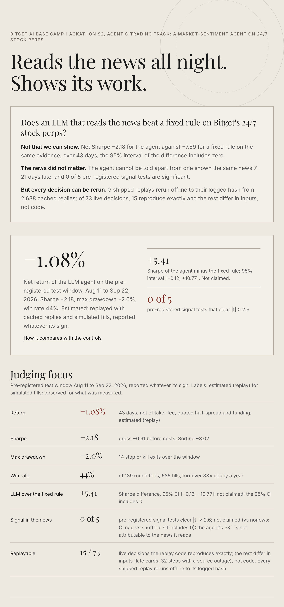
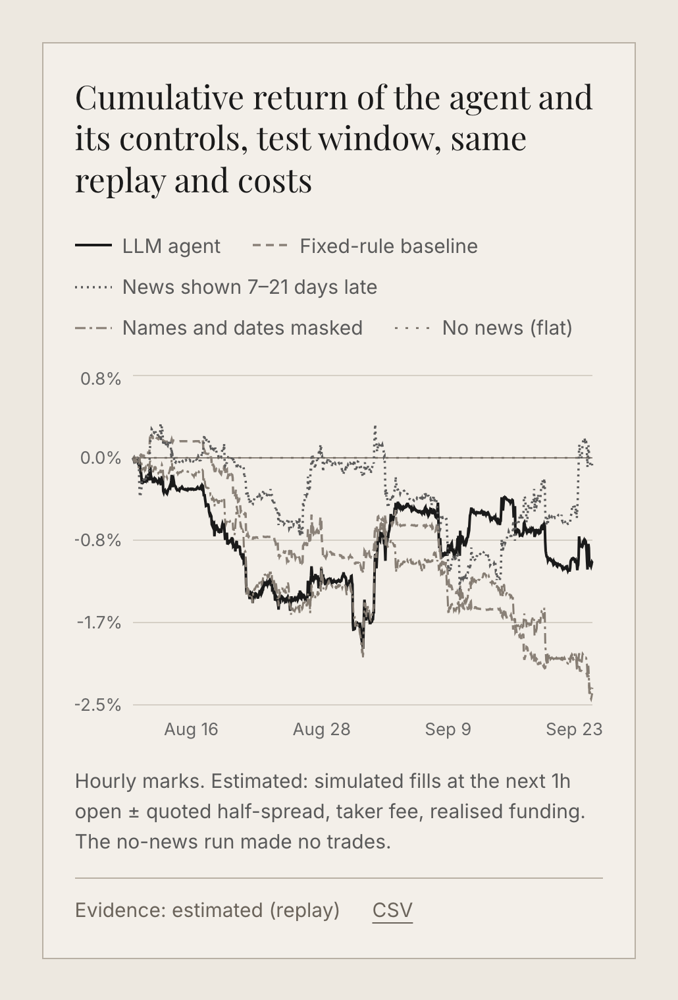
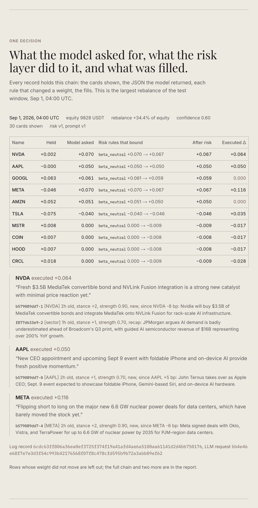
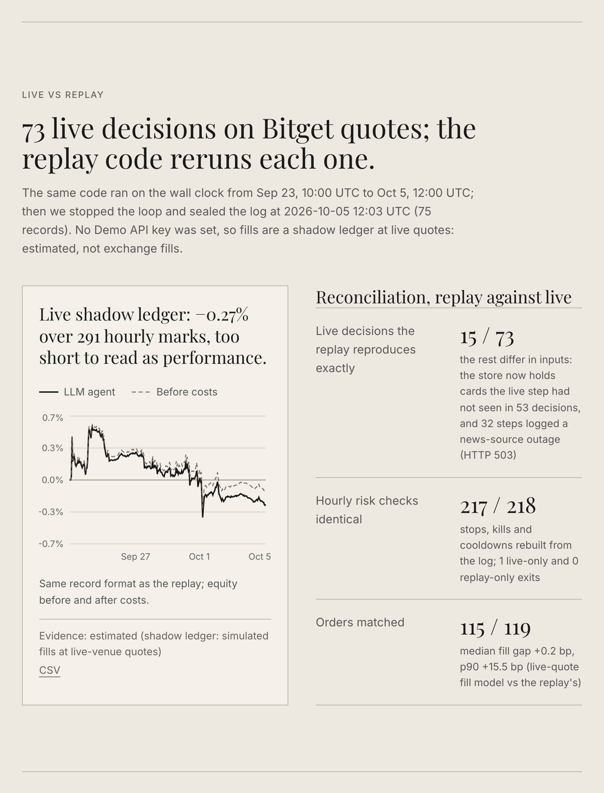
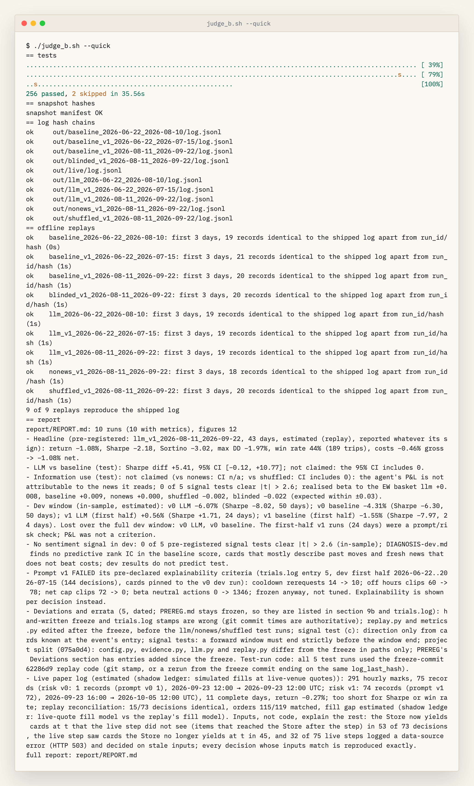
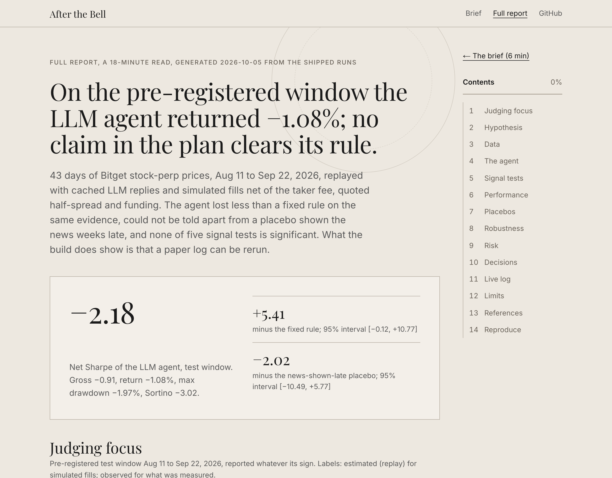
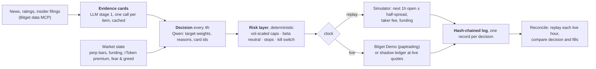

<div align="center">

# After the Bell

**An LLM that reads the news for Bitget's 24/7 stock perps, with a paper log you can rerun.<br/>The result is reported whatever its sign.**

Bitget AI Base Camp Hackathon S2, Agentic Trading track, Market Sentiment theme

[](https://github.com/lonetravelerxyz/after-the-bell/actions/workflows/judge.yml) [](LICENSE) 

### [**Open the site →**](https://lonetravelerxyz.github.io/after-the-bell/)

On the site: [the brief](https://lonetravelerxyz.github.io/after-the-bell/), [the full report](https://lonetravelerxyz.github.io/after-the-bell/report/).<br/>In this repo: [how to run it](#5-run-it), [the technical report](report/REPORT.md), [the frozen plan](docs/PREREG.md).

</div>

**Judging focus.** Pre-registered test window 2026-08-11 → 2026-09-22, net of taker fee, quoted half-spread and funding. Every number is *estimated (replay)*: simulated fills from cached LLM replies. Frozen plan: [`docs/PREREG.md`](docs/PREREG.md) at commit `62286d9`, before the test ran.

| Metric | Value |
|:--|:--|
| Return | **-1.08%** over 43 days |
| Sharpe | **-2.18** (Sortino -3.02) |
| Max drawdown | **-1.97%** |
| Win rate | **43.9%** of 585 fills; turnover 82.9× equity a year |
| LLM over a fixed rule on the same evidence | Sharpe difference **5.41**, 95% CI [-0.12, 10.77]: **not claimed: the 95% CI includes 0** |
| Does the news matter? | not claimed (vs nonews: CI n/a; vs shuffled: CI includes 0): the agent's P&L is not attributable to the news it reads; **0 of 5** pre-registered signal tests significant |
| Replayable | every shipped replay reruns offline to its logged hash (on macOS arm64, see section 5); **15 of 73** live decisions reproduced exactly, the rest differ in inputs, not code |

[](https://lonetravelerxyz.github.io/after-the-bell/)

## 1. The idea

Bitget's US-stock perpetuals trade around the clock; the stocks and the desks that read the news about them do not.
News lands after the close, overnight and at weekends, and the perp is where it gets priced first. So an agent reads
every news item, analyst action and insider filing as it arrives, turns each into an **evidence card** (LLM stage 1,
cached), and every four hours **decides a target book** for ten names (LLM stage 2), citing the cards behind each
position. A **deterministic risk layer** sits between the model and the market and has the last word.

The claim we can back is not about P&L. It is that the **paper log is backtestable**: the same code runs on a historical
clock and on the wall clock, every LLM reply is cached by prompt hash, every record is hash-chained, and each live hour is
recomputed by the replay code. That is also why the uncomfortable results below are visible instead of buried.

## 2. The result

The agent is measured against a **fixed rule** on the same cards and against three placebos through the same replay:
**no news**, the **news shown 7–21 days late**, and **names and dates masked**. The agent lost less than the rule, but
the bootstrap interval of the difference includes zero, and it cannot be told apart from the placebo that saw the news
weeks late. By the rules frozen in `docs/PREREG.md`, nothing is claimed.

[](https://lonetravelerxyz.github.io/after-the-bell/#result)

| Run (test window, risk v1) | Net return | Sharpe | Max DD |
|:--|--:|--:|--:|
| LLM agent | **-1.08%** | **-2.18** | -1.97% |
| Fixed-rule baseline | -2.37% | -7.59 | -2.64% |
| No news | +0.00% (no trades) | n/a | +0.00% |
| News shown 7–21 days late | -0.09% | -0.16 | -1.81% |

Cost ladder, LLM agent: gross -0.46% → after fees -1.04% → after spread -1.07% → after funding -1.08%.

## 3. One decision, end to end

Every record holds the chain: the cards shown, the JSON the model returned, each risk rule that changed a weight
(before → after), the post-risk target, the fills. The site shows the largest rebalance of the test window; the report
shows three.

[](https://lonetravelerxyz.github.io/after-the-bell/#decision)

## 4. Live vs replay

The same code ran on live Bitget quotes from 2026-09-23 to 2026-10-05: 291 hourly marks and
75 records (estimated (shadow ledger: simulated fills at live-venue quotes); no Demo API key was set, so no exchange fills). We stopped the loop
by hand on 2026-10-05 after the 12:00 UTC step and sealed the log (`out/live/SEAL.json`: file hashes and the last record
hash; the first seal, from 2026-09-28, still verifies records 1 to 31). The replay code reruns each hour:
15 of 73 decisions reproduce exactly; the rest differ in inputs,
not code (ratings and filings that reached the store after the step in 53
decisions, a news-source outage in 32 steps). Orders match
115 of 119, hourly risk checks 99.5%;
median fill gap 0.2 bp.

[](https://lonetravelerxyz.github.io/after-the-bell/#live)

## 5. Run it

```bash
./judge_b.sh            # tests -> snapshot hashes -> hash chains -> every shipped replay offline to its logged hash -> report
./judge_b.sh --quick    # same, first 3 days of each run, record by record (~5 min)
```



> [!TIP]
> Needs only [uv](https://docs.astral.sh/uv/), no API key: 2,638 cached LLM replies
> (8,901,638 prompt and 929,515 completion tokens) ship
> with the code, and `SENTIMENT_OFFLINE=1` turns a cache miss into an error instead of a network call. Change one byte
> under `snapshot/` and the hash check stops. [CI](https://github.com/lonetravelerxyz/after-the-bell/actions/workflows/judge.yml)
> runs `./judge_b.sh --quick` on every push and fails if a regenerated headline number differs from the committed report.

> [!NOTE]
> Bit-identical replays need macOS on Apple silicon, where we wrote the logs; CI gates on `macos-latest`. On Linux
> x86_64 the seven risk v1 runs differ from their first record: the 60-day beta (pandas mean, variance and covariance)
> rounds differently in its last bits, and the beta-neutral weights and fills follow it. The two v0 runs, which have no
> beta, match on both. CI runs Linux too, for information.

## 6. What else we tried

After the test window we tested 5 other ideas, each against criteria written in its own `trials.log`
before it ran. None cleared them (0 claimed), so the submission stays the pre-registered agent.
Section 7 of the report has the tables; the code is in `studies/b2/`, `studies/b4/` and `studies/b5/`.

| Idea | Result | Verdict |
|:--|:--|:--|
| **Crypto Fear & Greed, contrarian**: buy fear, sell greed on BTC, MSTR, COIN, MARA, RIOT, 2018–2026 | the long-only rule beats buy & hold with a CI excluding 0 in 0 of 10 asset-periods; in 2018–22, 12 of 15 slopes say greed was followed by *higher* returns | not claimed |
| **Fear & Greed on MSTR only**, long-only, since its first bitcoin purchase; paper log on the RMSTRUSDT rToken | Sharpe 0.39 vs buy & hold 0.90; rToken paper log -19.8% vs the rToken +22.2% | not claimed |
| **No news**: the ten names long, cut when volatility rises | daily 2021–26 Sharpe 0.82 vs 0.90 for the same average exposure, same max drawdown -59.1% | not claimed |
| **Crisis exit on BTC** from free public data, 2019–2026 | 61.1% false alarms; the chosen v1 returned +27.2% on the holdout vs +256.9% for a 200-day MA | not claimed |
| **Incident exit** on hacks and delistings | median token -32.8% 30 days after a hack alert, but X posted first in only 2 of 11 hacks | observed, not built |

## 7. The full report

Laid out like a research note: the hypothesis and 15 checked references, the data and what the model
knew (its price memory ends around 2025-06,
12 months before the replay starts), the agent, the signal tests,
performance net of costs, the placebos, what else we tried, the risk layer rule by rule with three decisions end to end,
the live log, every dated deviation from the frozen plan, and how to reproduce it. The same numbers, generated by `judge_b.sh`, are in [`report/REPORT.md`](report/REPORT.md) and
[`report/metrics.json`](report/metrics.json).

[](https://lonetravelerxyz.github.io/after-the-bell/report/)

## 8. More

<details>
<summary><b>The loop</b></summary>



</details>

<details>
<summary><b>The record</b></summary>

One line of `log.jsonl` per decision or risk exit, canonical JSON, `hash` = sha256 of the record, `prev_hash` = the
previous line's hash. Fields: the state shown to the model, the card ids, the LLM request hash, the model's raw reply and
parsed targets, the baseline's targets on the same cards, every risk action (`rule`, `before`, `after`, `ticker`), the
executed targets, orders, fills with fee and half-spread, positions, equity, and in live mode the pre-trade book and any
data warning. `uv run python -m sentiment.ledger out/*/log.jsonl` verifies every chain.

</details>

<details>
<summary><b>What we learned about the data</b></summary>

1. The data MCP stamps `published_at` with a `Z` suffix, but the stamps are **Beijing wall time**: items appeared up to 6 hours "in the future". Every news item is dated 8 hours earlier than stamped; the point-in-time store is tested for it.
2. Qwen's closed-book price memory ends around **2025-06** (median recall error of month-end closes jumps past 10%); the replay starts 12 months later.
3. The cards mostly **describe the move that already happened**: a large share are post-hoc explanations, flagged as such and never traded as fresh news.
4. Ratings and insider filings arrive late: a live step can decide on fewer cards than the store holds afterwards. The reconciliation reports it instead of hiding it.
5. Stock-perp long/short and taker-volume histories are empty on Bitget; only crypto has them. Funding history reaches back ~90 days.

</details>

<details>
<summary><b>Bitget toolchain</b></summary>

| Piece | Use |
|---|---|
| Public market API (v2) | 1h perp and rToken bars, funding settlements, live top-of-book quotes (the spread model and the shadow ledger) |
| Bitget data MCP (`bitget-mcp-server`, no key) | news label search, analyst price targets, insider filings, crypto fear & greed; `sentiment/mcp_client.py` is a small dependency-free client |
| Qwen via the hackathon gateway (`qwen3.8-max`) | evidence extraction and the decision; temperature 0, replies cached by prompt hash |
| Bitget Demo (`paptrading: 1`) | the live executor when `BITGET_DEMO_*` keys are set; otherwise a shadow ledger at live quotes |

</details>

<details>
<summary><b>Glossary</b></summary>

| Term | Meaning here |
|---|---|
| Evidence card | one news item, rating or filing turned into tickers, stance −2..+2, strength, horizon, novelty and a quote |
| Fixed-rule baseline | the same cards summed by stance and mapped to weights by a formula (`docs/CONTRACT.md`); the LLM's increment is measured against it |
| Placebo | the same agent with no news, with the news shown 7–21 days late, or with names and dates masked |
| Estimated / observed | simulated fills (replay, shadow ledger) / measured on the data or on the log |
| Not claimed | the pre-registered claim rule was not met; the number is still shown |

</details>

<details>
<summary><b>Repository layout</b></summary>

| Path | What it is |
|---|---|
| `judge_b.sh`, `.github/` | tests → snapshot hashes → hash chains → offline replays → report; CI runs the quick form on every push |
| `sentiment/` | `data` (point-in-time store) → `evidence` (cards) → `features` → `baseline` / `agent` (+ `prompts/`) → `risk` → `sim` / `live` → `ledger`; `replay`, `reconcile`, `signal_tests`, `metrics`, `report` |
| `tests/` | look-ahead injection, risk rules, ledger chain, replay determinism, reconciliation self-check |
| `snapshot/`, `static/`, `cache/` | frozen inputs with `MANIFEST.sha256`; the quoted-spread model; every cached LLM reply and the cards |
| `out/` | the shipped runs: `log.jsonl`, `equity.csv`, `metrics.json` per run; `live/` with `SEAL.json` and `reconcile.json` |
| `report/` | `REPORT.md`, `metrics.json`, figures, all generated |
| `docs/` | `PREREG.md` (frozen), `CONTRACT.md`, `DIAGNOSIS-dev.md`, the planning spec |
| `trials.log` | every variant, check and deviation, dated |
| `studies/b2/`, `studies/b4/`, `studies/b5/` | the other strategies of section 6, each with its `trials.log`; their outputs in `out/b2/`, `out/b4/`, `out/b5/` |
| `site/` | the static export of the demo site, published by Pages |

</details>

<div align="center"><sub>Code under the <a href="LICENSE">MIT License</a>. Market data in <code>snapshot/</code> comes from Bitget's public API and data MCP and stays subject to Bitget's terms.<br/>Research code for a hackathon. Not investment advice.</sub></div>
