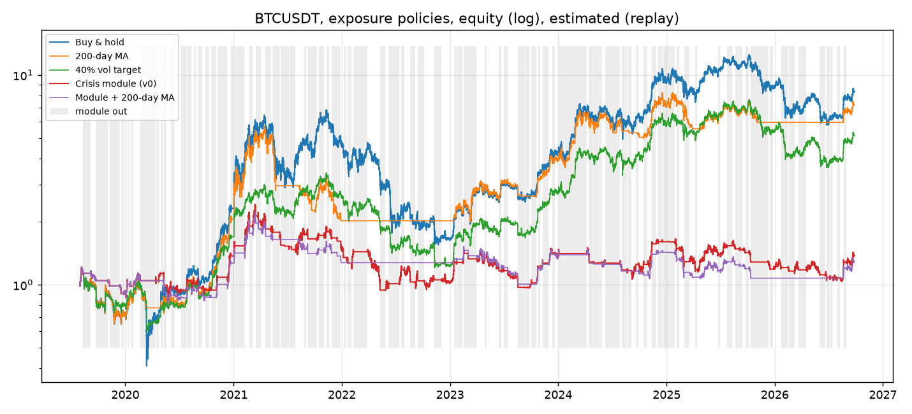
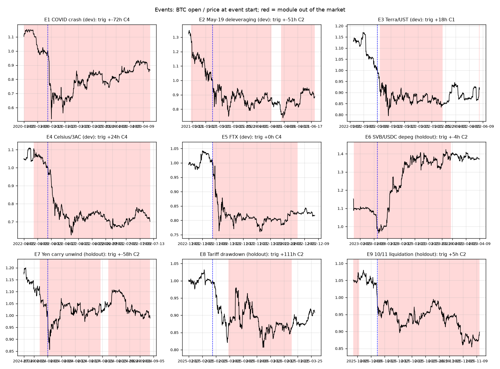

# B2-C crisis-derisk module v0: report

Generated by `uv run python -m b2.report` from `out/b2/`. Every number is **estimated (replay, simulated fills at next 1h open)**. Window 2019-08-01 -> 2026-09-26, 62721 hourly bars (0 gaps carried). Rules v0 fixed before the run (spec `docs/spec-B2-crisis-derisk.md` section 4), not tuned.

## 1. Policies over the full window

| Policy | Total return | CAGR | Ann. vol | Sharpe | Max DD | Calmar | Time in market | Position changes | Costs paid |
|---|---:|---:|---:|---:|---:|---:|---:|---:|---:|
| Buy & hold | +733.4% | +34.5% | +61.9% | 0.79 | -77.2% | 0.45 | 100% | 0 | +0.08% |
| 200-day MA | +620.2% | +31.8% | +46.6% | 0.82 | -65.2% | 0.49 | 62% | 56 | +4.56% |
| 40% vol target | +415.9% | +25.8% | +43.7% | 0.74 | -64.7% | 0.40 | 76% | 1975 | +3.06% |
| Crisis module (v0) | +37.6% | +4.6% | +33.1% | 0.30 | -61.2% | 0.07 | 40% | 181 | +14.48% |
| Module + 200-day MA | +28.6% | +3.6% | +27.0% | 0.26 | -55.2% | 0.06 | 25% | 135 | +10.80% |

Funding sensitivity (0.01%/8h paid while long): module +0.2% (Sharpe 0.16), buy & hold +280.5% (Sharpe 0.61).

## 2. Exit episodes and false alarms

Rule hours true: {'C1': 364, 'C2': 2585, 'C3': 624, 'C4': 4189}. Episodes (out-of-market spells): **90**, first rule of each: {'C1': 8, 'C2': 39, 'C3': 5, 'C4': 38}. False alarms (BTC did not fall a further 10% within 30 days of the exit): **55** (61%), mean BTC move exit->re-entry on false alarms +7.8%, on hits -5.3% (negative = the exit avoided a loss).

| Exit | Re-entry | Hours out | Rules | BTC min in 30d | BTC exit->re-entry | False alarm | F&G at exit |
|---|---|---:|---|---:|---:|---|---:|
| 2019-08-11 01:00 | 2019-09-06 00:00 | 623 | C4 | -17.6% | -7.4% |  | 59 |
| 2019-09-24 01:00 | 2019-11-03 02:00 | 961 | C4 | -23.9% | -4.5% |  | 41 |
| 2019-11-09 01:00 | 2019-12-12 20:00 | 811 | C4 | -25.8% | -18.3% |  | 42 |
| 2019-12-18 01:00 | 2019-12-25 21:00 | 188 | C4 | -1.7% | +8.8% | yes | 23 |
| 2020-01-08 20:00 | 2020-01-16 00:00 | 172 | C2 | -3.2% | +10.7% | yes | 40 |
| 2020-01-19 12:00 | 2020-01-28 20:00 | 224 | C2 | -5.0% | +3.8% | yes | 51 |
| 2020-02-19 22:00 | 2020-04-11 16:00 | 1242 | C2 | -57.0% | -28.9% |  | 53 |
| 2020-04-15 10:00 | 2020-04-23 00:00 | 182 | C4 | -3.9% | +4.2% | yes | 15 |
| 2020-04-29 01:00 | 2020-05-08 09:00 | 224 | C4 | +0.0% | +27.5% | yes | 26 |
| 2020-05-10 01:00 | 2020-05-19 09:00 | 224 | C1,C2 | -5.1% | +12.8% | yes | 56 |
| 2020-06-02 16:00 | 2020-06-15 19:00 | 315 | C2 | -5.6% | -0.6% | yes | 50 |
| 2020-07-08 01:00 | 2020-07-15 07:00 | 174 | C4 | -1.8% | -0.1% | yes | 43 |
| 2020-07-16 01:00 | 2020-07-26 22:00 | 261 | C4 | -1.5% | +7.4% | yes | 44 |
| 2020-07-28 22:00 | 2020-08-10 04:00 | 294 | C2 | -1.2% | +9.4% | yes | 58 |
| 2020-08-20 01:00 | 2020-08-27 14:00 | 181 | C4 | -15.6% | -3.3% |  | 80 |
| 2020-09-03 13:00 | 2020-09-16 09:00 | 308 | C2 | -8.1% | +0.6% | yes | 83 |
| 2020-09-27 07:00 | 2020-10-11 00:00 | 329 | C4 | -2.1% | +6.0% | yes | 45 |
| 2020-10-17 01:00 | 2020-11-03 09:00 | 416 | C4 | +0.0% | +19.6% | yes | 52 |
| 2020-11-07 00:00 | 2020-12-09 23:00 | 791 | C2 | -6.0% | +19.0% | yes | 90 |
| 2020-12-21 10:00 | 2021-01-02 04:00 | 282 | C2 | -4.9% | +25.1% | yes | 92 |
| 2021-01-03 19:00 | 2021-02-06 14:00 | 811 | C2 | -10.0% | +22.4% | yes | 94 |
| 2021-02-23 06:00 | 2021-03-05 19:00 | 253 | C1 | -13.6% | -3.0% |  | 94 |
| 2021-03-16 04:00 | 2021-03-23 22:00 | 186 | C1 | -6.1% | +0.7% | yes | 76 |
| 2021-03-25 13:00 | 2021-04-01 13:00 | 168 | C1 | -6.1% | +15.0% | yes | 65 |
| 2021-04-18 04:00 | 2021-05-06 00:00 | 428 | C1 | -22.1% | +5.1% |  | 76 |
| 2021-05-12 16:00 | 2021-06-05 08:00 | 568 | C4 | -42.9% | -32.3% |  | 61 |
| 2021-06-08 03:00 | 2021-06-20 23:00 | 308 | C1 | -10.4% | +9.2% |  | 15 |
| 2021-06-21 02:00 | 2021-07-06 08:00 | 366 | C4 | -17.0% | -1.2% |  | 21 |
| 2021-07-07 08:00 | 2021-07-15 00:00 | 184 | C4 | -15.3% | -5.5% |  | 20 |
| 2021-07-15 11:00 | 2021-07-28 03:00 | 304 | C4 | -7.7% | +25.1% | yes | 21 |
| 2021-08-27 01:00 | 2021-09-03 05:00 | 172 | C4 | -14.3% | +5.2% |  | 75 |
| 2021-09-07 15:00 | 2021-10-08 08:00 | 737 | C2 | -14.4% | +15.9% |  | 79 |
| 2021-10-15 01:00 | 2021-11-01 08:00 | 415 | C4 | +0.0% | +9.1% | yes | 70 |
| 2021-11-11 01:00 | 2021-11-19 17:00 | 208 | C4 | -28.5% | -10.5% |  | 75 |
| 2021-11-28 03:00 | 2021-12-14 23:00 | 404 | C4 | -16.0% | -11.2% |  | 21 |
| 2021-12-15 16:00 | 2021-12-27 23:00 | 295 | C4 | -12.7% | +9.4% |  | 21 |
| 2022-01-07 01:00 | 2022-01-16 15:00 | 230 | C4 | -22.6% | +1.2% |  | 15 |
| 2022-01-21 01:00 | 2022-02-01 22:00 | 285 | C4 | -19.1% | -5.1% |  | 24 |
| 2022-02-09 02:00 | 2022-03-28 00:00 | 1126 | C4 | -21.0% | +6.8% |  | 48 |
| 2022-05-09 19:00 | 2022-05-28 06:00 | 443 | C1 | -12.1% | -6.3% |  | 18 |
| 2022-06-07 20:00 | 2022-07-13 22:00 | 866 | C2 | -42.7% | -35.8% |  | 13 |
| 2022-07-21 02:00 | 2022-07-30 01:00 | 215 | C4 | -10.7% | +3.0% |  | 31 |
| 2022-08-19 23:00 | 2022-09-05 00:00 | 385 | C1 | -11.3% | -4.6% |  | 30 |
| 2022-09-13 19:00 | 2022-10-05 17:00 | 526 | C2 | -9.3% | -0.1% | yes | 25 |
| 2022-11-08 01:00 | 2022-12-03 00:00 | 599 | C4 | -23.7% | -16.7% |  | 33 |
| 2023-01-15 01:00 | 2023-01-22 09:00 | 176 | C2 | -0.7% | +10.3% | yes | 46 |
| 2023-01-24 11:00 | 2023-02-11 16:00 | 437 | C4 | -6.3% | -5.1% | yes | 50 |
| 2023-02-16 23:00 | 2023-03-02 20:00 | 333 | C2 | -18.3% | -2.3% |  | 53 |
| 2023-03-03 02:00 | 2023-03-31 15:00 | 685 | C2 | -11.4% | +28.8% |  | 51 |
| 2023-04-27 11:00 | 2023-05-04 18:00 | 175 | C2 | -9.9% | -0.5% | yes | 56 |
| 2023-06-14 21:00 | 2023-06-22 20:00 | 191 | C2 | -0.0% | +21.3% | yes | 45 |
| 2023-06-30 17:00 | 2023-07-14 00:00 | 319 | C2 | -4.4% | +3.5% | yes | 54 |
| 2023-08-17 22:00 | 2023-09-12 04:00 | 606 | C2 | -4.7% | -1.7% | yes | 52 |
| 2023-09-12 05:00 | 2023-09-19 09:00 | 172 | C2 | +0.0% | +5.1% | yes | 40 |
| 2023-09-19 13:00 | 2023-09-26 15:00 | 170 | C2 | -4.0% | -3.6% | yes | 46 |
| 2023-10-02 23:00 | 2023-10-20 00:00 | 409 | C2 | -3.4% | +4.2% | yes | 48 |
| 2023-10-25 03:00 | 2023-11-01 13:00 | 178 | C2 | -1.2% | +2.3% | yes | 66 |
| 2023-11-10 07:00 | 2023-11-29 15:00 | 464 | C2 | -3.8% | +3.3% | yes | 69 |
| 2023-12-11 04:00 | 2023-12-20 15:00 | 227 | C2 | -3.8% | +3.7% | yes | 74 |
| 2024-01-03 12:00 | 2024-01-20 15:00 | 411 | C2 | -11.3% | -5.0% |  | 71 |
| 2024-01-20 19:00 | 2024-04-06 05:00 | 1834 | C4 | -6.8% | +62.8% | yes | 51 |
| 2024-04-13 21:00 | 2024-04-28 01:00 | 340 | C2 | -8.0% | +2.9% | yes | 79 |
| 2024-04-28 23:00 | 2024-05-27 15:00 | 688 | C4 | -9.9% | +10.1% | yes | 67 |
| 2024-06-08 01:00 | 2024-07-27 00:00 | 1175 | C4 | -22.3% | -2.2% |  | 77 |
| 2024-08-02 15:00 | 2024-08-20 13:00 | 430 | C2 | -21.1% | -3.9% |  | 52 |
| 2024-08-22 19:00 | 2024-09-04 23:00 | 316 | C4 | -12.3% | -3.6% |  | 26 |
| 2024-09-19 01:00 | 2024-09-27 00:00 | 191 | C3 | -4.4% | +4.8% | yes | 45 |
| 2024-10-15 15:00 | 2024-10-29 00:00 | 321 | C2 | +0.0% | +7.0% | yes | 48 |
| 2024-11-13 00:00 | 2024-11-27 09:00 | 345 | C2 | -1.6% | +6.3% | yes | 80 |
| 2024-12-04 01:00 | 2024-12-17 00:00 | 311 | C3 | -4.2% | +10.6% | yes | 76 |
| 2024-12-18 01:00 | 2025-01-11 00:00 | 575 | C3 | -14.5% | -10.7% |  | 87 |
| 2025-01-11 01:00 | 2025-01-28 17:00 | 424 | C3 | -4.1% | +8.1% | yes | 50 |
| 2025-02-03 08:00 | 2025-02-12 17:00 | 225 | C2 | -17.1% | +1.8% |  | 60 |
| 2025-02-28 16:00 | 2025-03-19 06:00 | 446 | C2 | -7.6% | -0.9% | yes | 10 |
| 2025-04-07 09:00 | 2025-04-14 20:00 | 179 | C2 | -1.5% | +11.3% | yes | 34 |
| 2025-06-22 23:00 | 2025-06-30 00:00 | 169 | C2 | -0.3% | +7.3% | yes | 49 |
| 2025-07-24 01:00 | 2025-08-10 01:00 | 408 | C4 | -5.8% | -1.9% | yes | 74 |
| 2025-08-20 01:00 | 2025-09-04 00:00 | 359 | C4 | -5.1% | -1.3% | yes | 56 |
| 2025-09-05 23:00 | 2025-09-14 08:00 | 201 | C2 | -1.8% | +4.5% | yes | 51 |
| 2025-09-24 01:00 | 2025-10-05 13:00 | 276 | C4 | -6.9% | +9.7% | yes | 43 |
| 2025-10-11 02:00 | 2025-12-09 16:00 | 1430 | C2 | -10.3% | -16.5% |  | 64 |
| 2025-12-16 01:00 | 2025-12-27 00:00 | 263 | C4 | -1.6% | +1.7% | yes | 16 |
| 2026-01-22 15:00 | 2026-02-15 00:00 | 561 | C2 | -29.4% | -21.6% |  | 24 |
| 2026-02-18 01:00 | 2026-03-08 11:00 | 442 | C4 | -6.5% | +0.9% | yes | 10 |
| 2026-03-22 01:00 | 2026-04-17 00:00 | 623 | C4 | -4.8% | +9.0% | yes | 12 |
| 2026-06-02 01:00 | 2026-06-19 16:00 | 423 | C4 | -18.3% | -11.4% |  | 29 |
| 2026-06-25 05:00 | 2026-07-05 00:00 | 235 | C2 | -5.0% | +2.9% | yes | 17 |
| 2026-07-07 03:00 | 2026-07-15 00:00 | 189 | C4 | -2.6% | +2.7% | yes | 24 |
| 2026-07-31 01:00 | 2026-08-08 00:00 | 191 | C3 | -3.4% | +0.3% | yes | 28 |
| 2026-08-22 09:00 | 2026-08-29 17:00 | 176 | C2 | -2.3% | +1.0% | yes | 72 |

## 3. Event study

Events covered 9, triggered 9.

| Event | Split | BTC start->trough (30d) | Triggered | Hours after start | Rules | BTC trigger->trough | Re-entry | BTC trigger->re-entry |
|---|---|---:|---|---:|---|---:|---|---:|
| E1 COVID crash | dev | -47.9% | yes | -72 | C4 | -48.9% | 2020-04-11 16:00 | -15.5% |
| E2 May-19 deleveraging | dev | -26.1% | yes | -51 | C2 | -29.8% | 2021-06-05 08:00 | -16.8% |
| E3 Terra/UST | dev | -20.5% | yes | +18 | C1 | -12.1% | 2022-05-28 06:00 | -6.3% |
| E4 Celsius/3AC | dev | -37.4% | yes | +24 | C4 | -32.3% | 2022-07-13 22:00 | -24.2% |
| E5 FTX | dev | -24.0% | yes | +0 | C4 | -23.7% | 2022-12-03 00:00 | -16.7% |
| E6 SVB/USDC depeg | holdout | -3.6% | yes | -4 | C2 | -2.5% | 2023-03-31 15:00 | +41.8% |
| E7 Yen carry unwind | holdout | -14.4% | yes | -58 | C2 | -21.1% | 2024-08-20 13:00 | -3.9% |
| E8 Tariff drawdown | holdout | -19.3% | yes | +111 | C2 | -7.6% | 2025-03-19 06:00 | -0.9% |
| E9 10/11 liquidation | holdout | -14.6% | yes | +5 | C2 | -10.3% | 2025-12-09 16:00 | -16.5% |

## 4. Year by year

| Year | Buy & hold | 200-day MA | 40% vol target | Crisis module (v0) | Module + 200-day MA |
|---|---:|---:|---:|---:|---:|
| 2019 | -28.6% | -28.6% | -20.8% | -9.5% | -9.5% |
| 2020 | +223.9% | +188.3% | +113.8% | +51.7% | +40.1% |
| 2021 | +98.7% | -1.9% | +53.8% | +6.5% | +0.5% |
| 2022 | -64.2% | +0.0% | -52.9% | -30.1% | +0.0% |
| 2023 | +155.6% | +94.4% | +123.3% | +33.5% | +5.6% |
| 2024 | +121.0% | +81.8% | +110.7% | +17.7% | +6.1% |
| 2025 | -6.3% | -16.8% | -7.3% | -25.8% | -24.7% |
| 2026 | -4.0% | +21.2% | -3.6% | +15.8% | +19.8% |

## 5. Diagnostics: each rule alone and leave-one-out (not used to choose v0)

| Variant | Total return | Max DD | Calmar | Sharpe | Time in market | Episodes | False alarms | Events hit (of 9) |
|---|---:|---:|---:|---:|---:|---:|---:|---:|
| C1 only | +503.8% | -69.5% | 0.41 | 0.73 | 89% | 28 | 16 | 7 |
| C2 only | +71.3% | -67.2% | 0.12 | 0.39 | 66% | 74 | 53 | 9 |
| C3 only | +550.4% | -76.2% | 0.39 | 0.74 | 94% | 16 | 9 | 3 |
| C4 only | +488.2% | -67.3% | 0.42 | 0.77 | 61% | 69 | 38 | 7 |
| without C1 | +45.1% | -58.1% | 0.09 | 0.32 | 41% | 88 | 55 | 9 |
| without C2 | +116.6% | -71.0% | 0.16 | 0.46 | 53% | 86 | 52 | 9 |
| without C3 | +58.3% | -62.3% | 0.11 | 0.36 | 43% | 89 | 54 | 9 |
| without C4 | +25.9% | -65.1% | 0.05 | 0.29 | 61% | 83 | 56 | 9 |
| all (v0) | +37.6% | -61.2% | 0.07 | 0.30 | 40% | 90 | 55 | 9 |

## 6. Reading against the spec's three criteria

1. Max DD and Calmar better than buy & hold: **no** (DD -61.2% vs -77.2%; Calmar 0.07 vs 0.45).
2. Better than the 200-day MA and the 40% vol target on both: **no** (MA: DD -65.2%, Calmar 0.49; vol target: DD -64.7%, Calmar 0.40).
3. False alarms: 55 of 90 episodes; mean missed move on false alarms +7.8% vs mean avoided move on hits -5.3%.

All of the above is in-sample: the nine events were known when the rules were written, even though no threshold was tuned on the results.

## 7. v1 trials (b2/trials.log): grid on dev 2019-08..2022-12, chosen configuration once on holdout 2023-01..

C1 and C3 (major stablecoins only) are always on. Selection on dev: Calmar of the module over its base minus the base's own Calmar, tie-break fewer false alarms.

| C2 | C4 | C5 (DVOL) | Re-entry | Base | Dev return | Dev max DD | Dev Calmar | Base Calmar | Increment | Episodes | False alarms | Events hit |
|---|---|---|---|---|---:|---:|---:|---:|---:|---:|---:|---:|
| off | off | off | recover | one | +60.4% | -56.5% | 0.26 | 0.20 | 0.06 | 14 | 9 | 5/5 |
| off | off | off | recover | ma200 | +48.0% | -56.5% | 0.22 | 0.36 | -0.14 | 15 | 9 | 5/5 |
| off | off | off | ma20 | one | -15.2% | -77.9% | -0.06 | 0.20 | -0.26 | 22 | 10 | 5/5 |
| off | off | off | ma20 | ma200 | +47.3% | -48.9% | 0.25 | 0.36 | -0.11 | 18 | 10 | 5/5 |
| off | off | 1.25 | recover | one | +60.4% | -56.5% | 0.26 | 0.20 | 0.06 | 14 | 9 | 5/5 |
| off | off | 1.25 | recover | ma200 | +48.0% | -56.5% | 0.22 | 0.36 | -0.14 | 15 | 9 | 5/5 |
| off | off | 1.25 | ma20 | one | +0.4% | -73.8% | 0.00 | 0.20 | -0.20 | 21 | 10 | 5/5 |
| off | off | 1.25 | ma20 | ma200 | +47.3% | -48.9% | 0.25 | 0.36 | -0.11 | 18 | 10 | 5/5 |
| off | q95 x 2d | off | recover | one | +26.9% | -56.5% | 0.13 | 0.20 | -0.07 | 16 | 11 | 5/5 |
| off | q95 x 2d | off | recover | ma200 | +17.2% | -56.5% | 0.08 | 0.36 | -0.27 | 17 | 11 | 5/5 |
| off | q95 x 2d | off | ma20 | one | -34.3% | -78.9% | -0.15 | 0.20 | -0.35 | 27 | 14 | 5/5 |
| off | q95 x 2d | off | ma20 | ma200 | +19.8% | -47.5% | 0.11 | 0.36 | -0.24 | 20 | 12 | 5/5 |
| off | q95 x 2d | 1.25 | recover | one | +26.9% | -56.5% | 0.13 | 0.20 | -0.07 | 16 | 11 | 5/5 |
| off | q95 x 2d | 1.25 | recover | ma200 | +17.2% | -56.5% | 0.08 | 0.36 | -0.27 | 17 | 11 | 5/5 |
| off | q95 x 2d | 1.25 | ma20 | one | -22.3% | -75.1% | -0.09 | 0.20 | -0.30 | 26 | 14 | 5/5 |
| off | q95 x 2d | 1.25 | ma20 | ma200 | +19.8% | -47.5% | 0.11 | 0.36 | -0.24 | 20 | 12 | 5/5 |
| 3.0 | off | off | recover | one | +26.8% | -55.3% | 0.13 | 0.20 | -0.07 | 17 | 12 | 5/5 |
| 3.0 | off | off | recover | ma200 | +17.0% | -58.8% | 0.08 | 0.36 | -0.27 | 18 | 12 | 5/5 |
| 3.0 | off | off | ma20 | one | -22.7% | -77.1% | -0.09 | 0.20 | -0.30 | 25 | 13 | 5/5 |
| 3.0 | off | off | ma20 | ma200 | +24.3% | -53.3% | 0.12 | 0.36 | -0.23 | 21 | 13 | 5/5 |
| 3.0 | off | 1.25 | recover | one | +26.8% | -55.3% | 0.13 | 0.20 | -0.07 | 17 | 12 | 5/5 |
| 3.0 | off | 1.25 | recover | ma200 | +17.0% | -58.8% | 0.08 | 0.36 | -0.27 | 18 | 12 | 5/5 |
| 3.0 | off | 1.25 | ma20 | one | -8.5% | -72.9% | -0.04 | 0.20 | -0.24 | 24 | 13 | 5/5 |
| 3.0 | off | 1.25 | ma20 | ma200 | +24.3% | -53.3% | 0.12 | 0.36 | -0.23 | 21 | 13 | 5/5 |
| 3.0 | q95 x 2d | off | recover | one | +6.5% | -57.3% | 0.03 | 0.20 | -0.17 | 18 | 13 | 5/5 |
| 3.0 | q95 x 2d | off | recover | ma200 | -1.7% | -60.6% | -0.01 | 0.36 | -0.36 | 19 | 13 | 5/5 |
| 3.0 | q95 x 2d | off | ma20 | one | -36.5% | -78.2% | -0.16 | 0.20 | -0.36 | 29 | 16 | 5/5 |
| 3.0 | q95 x 2d | off | ma20 | ma200 | +7.3% | -55.4% | 0.04 | 0.36 | -0.32 | 22 | 14 | 5/5 |
| 3.0 | q95 x 2d | 1.25 | recover | one | +6.5% | -57.3% | 0.03 | 0.20 | -0.17 | 18 | 13 | 5/5 |
| 3.0 | q95 x 2d | 1.25 | recover | ma200 | -1.7% | -60.6% | -0.01 | 0.36 | -0.36 | 19 | 13 | 5/5 |
| 3.0 | q95 x 2d | 1.25 | ma20 | one | -24.8% | -74.2% | -0.11 | 0.20 | -0.31 | 28 | 16 | 5/5 |
| 3.0 | q95 x 2d | 1.25 | ma20 | ma200 | +7.3% | -55.4% | 0.04 | 0.36 | -0.32 | 22 | 14 | 5/5 |

**Chosen on dev**: C2 off, C4 off, C5 off, re-entry recover, base one.

| Holdout 2023-01 -> now | Total return | Max DD | Calmar | Sharpe | Time in market | Episodes | False alarms | Events hit |
|---|---:|---:|---:|---:|---:|---:|---:|---:|
| Module (chosen) | +27.2% | -59.4% | 0.11 | 0.36 | 67% | 4 | 4 | 3/4 |
| Buy & hold | +407.8% | -53.8% | 1.01 | 1.16 | 100% | | | |
| 200-day MA | +256.9% | -34.0% | 1.19 | 1.09 | 65% | | | |
| 40% vol target | +320.7% | -52.9% | 0.89 | 1.16 | 88% | | | |

### 7a. Lead time per rule and event (diagnostic)

Cell = hours after the event start when the rule first fires (negative = before) and BTC's move from the next open to the 30-day trough, i.e. what an exit at that hour avoids; `*` = fired only after the trough.

| Event | BTC start->trough | C1 | C2_v0(2x) | C2_v1(3x) | C3 | C4_v0(q90) | C4_v1(q95x2d) | C5_dvol |
|---|---:|---:|---:|---:|---:|---:|---:|---:|
| E1 COVID crash | -47.9% | -68h -47.4% | -67h -47.9% | +10h -32.4% | - | -72h -48.9% | -25h -47.7% | - |
| E2 May-19 deleveraging | -26.1% | -45h -26.2% | -51h -29.8% | +12h -9.5% | +144h -19.5% | -119h -36.7% | -1h -26.1% | -53h -30.4% |
| E3 Terra/UST | -20.5% | +18h -12.1% | +23h -10.0% | +60h -7.6% | +24h -12.1% | +24h -12.1% | - | +17h -13.5% |
| E4 Celsius/3AC | -37.4% | +31h -28.2% | -101h -42.7% | +50h -17.3% | - | +24h -32.3% | - | +26h -29.7% |
| E5 FTX | -24.0% | +18h -15.9% | +16h -23.2% | +17h -19.1% | - | +0h -23.7% | - | +19h -14.3% |
| E6 SVB/USDC depeg | -3.6% | - | -4h -2.5% | +12h +0.0%* | +72h +0.0%* | - | - | +134h +0.0%* |
| E7 Yen carry unwind | -14.4% | +1h -8.5% | -58h -21.1% | +7h -5.4% | - | -48h -18.5% | -1h -14.4% | +7h -5.4% |
| E8 Tariff drawdown | -19.3% | +193h -6.9% | +111h -7.6% | +193h -6.9% | - | - | - | - |
| E9 10/11 liquidation | -14.6% | - | +5h -10.3% | - | - | +28h -9.1% | - | +2h -12.3% |

Reading: detection is not the problem (C2 at 2x fires before or within a day of eight of nine events with 8-48% still to fall); the false alarms between events and the re-entry rule are. 'recover' (re-enter above the exit price) stays out for the whole 2022 bear and misses 2023-24; 'ma20' re-enters into every bounce. No configuration adds to the 200-day MA on dev; the chosen one fails on holdout.
