# After the Bell — an LLM news agent on Bitget stock perps

Generated 2026-10-05T13:58:49+00:00 by `uv run python -m sentiment.report` from `out/`. Every number below is a value in `report/metrics.json`. Replay numbers are **estimated (replay)**: simulated fills at the next 1h open ± quoted half-spread, taker fee, realised funding. Live numbers are labelled by broker mode: only Bitget Demo fills are **observed**; a shadow ledger (live-venue quotes, simulated fills) is **estimated**.

## Summary

**Judging focus.** Pre-registered test window 2026-08-11 → 2026-09-22, net of taker fee, quoted half-spread and funding; every number is *estimated (replay)*.

| Metric | Value |
|:--|:--|
| Return | −1.08% over 43 days |
| Sharpe (Sortino) | −2.18 (−3.02) |
| Max drawdown | −1.97% |
| Win rate | 44% of 189 round trips; turnover 82.9× equity a year |
| LLM over a fixed rule on the same evidence | Sharpe difference +5.41, 95% CI [−0.12, +10.77]: not claimed: the 95% CI includes 0 |
| Does the news matter? | not claimed (vs nonews: CI n/a; vs shuffled: CI includes 0): the agent's P&L is not attributable to the news it reads; 0 of 5 signal tests significant |
| Replayable | 15 of 73 live decisions reproduced exactly; every shipped replay reruns offline to its logged hash |

**What.** An agent reads every news item, analyst action and insider filing about ten Bitget stock perps as it arrives, turns each into an evidence card, and every four hours sets a target book citing the cards behind each position. A deterministic risk layer has the last word. The same code runs on a historical and on the wall clock, every LLM reply is cached and every record is hash-chained, so the paper log can be rerun.

**Findings.**

- Headline (pre-registered: llm_v1_2026-08-11_2026-09-22, 43 days, estimated (replay), reported whatever its sign): return −1.08%, Sharpe −2.18, Sortino −3.02, max DD −1.97%, win rate 44% (189 trips), costs −0.46% gross -> −1.08% net.
- LLM vs baseline (test): Sharpe diff +5.41, 95% CI [−0.12, +10.77]; not claimed: the 95% CI includes 0.
- Information use (test): not claimed (vs nonews: CI n/a; vs shuffled: CI includes 0): the agent's P&L is not attributable to the news it reads; 0 of 5 signal tests clear \|t\| > 2.6; realised beta to the EW basket llm +0.008, baseline +0.009, nonews +0.000, shuffled −0.002, blinded −0.022 (expected within ±0.03).
- Dev window (in-sample, estimated): v0 LLM −6.07% (Sharpe −8.02, 50 days); v0 baseline −4.31% (Sharpe −6.30, 50 days); v1 LLM (first half) +0.56% (Sharpe +1.71, 24 days); v1 baseline (first half) −1.55% (Sharpe −7.97, 24 days). Lost over the full dev window: v0 LLM, v0 baseline. The first-half v1 runs (24 days) were a prompt/risk check; P&L was not a criterion.
- No sentiment signal in dev: 0 of 5 pre-registered signal tests clear \|t\| > 2.6 (in-sample); DIAGNOSIS-dev.md finds no predictive rank IC in the baseline score, cards that mostly describe past moves and fresh news that does not beat costs; dev results do not predict test.
- Prompt v1 FAILED its pre-declared explainability criteria (trials.log entry 5, dev first half 2026-06-22..2026-07-15 (144 decisions), cards pinned to the v0 dev run): cooldown rerequests 14 -> 10; off hours clips 60 -> 78; net cap clips 72 -> 0; beta neutral actions 0 -> 1346; frozen anyway, not tuned. Explainability is shown per decision instead.
- Deviations and errata (5, dated; PREREG.md stays frozen, so they are listed in section 9b and trials.log): hand-written freeze and trials.log stamps are wrong (git commit times are authoritative); replay.py and metrics.py edited after the freeze, before the llm/nonews/shuffled test runs; signal test (c): direction only from cards known at the event's entry; signal tests: a forward window must end strictly before the window end; project split (075a0d4): config.py, evidence.py, llm.py and replay.py differ from the freeze in paths only; PREREG's Deviations section has entries added since the freeze. Test-run code: all 5 test runs used the freeze-commit 62286d9 replay code (git stamp, or a rerun from the freeze commit ending on the same log_last_hash).
- Live paper log (estimated (shadow ledger: simulated fills at live-venue quotes)): 291 hourly marks, 75 records (risk v0: 1 records (prompt v0 1), 2026-09-23 12:00 → 2026-09-23 12:00 UTC; risk v1: 74 records (prompt v1 72), 2026-09-23 16:00 → 2026-10-05 12:00 UTC), 11 complete days, return −0.27%; too short for Sharpe or win rate; replay reconciliation: 15/73 decisions identical, orders 115/119 matched, fill gap estimated (shadow ledger: live-quote fill model vs the replay's fill model). Inputs, not code, explain the rest: the Store now yields cards at t that the live step did not see (items that reached the Store after the step) in 53 of 73 decisions, the live step saw cards the Store no longer yields at t in 45, and 32 of 75 live steps logged a data-source error (HTTP 503) and decided on stale inputs; every decision whose inputs match is reproduced exactly.
- Also tested after the test window (section 7): 5 other strategies, each against criteria written before its run; 0 cleared them. The submission stays the pre-registered v1.

## 1. Hypothesis and prior evidence

News moves prices, and part of the move comes late. Media pessimism predicts price pressure that later reverses [14]; the negative words in firm news predict earnings and returns [15]; prices drift after news headlines but reverse after large moves without news [3]; broad sentiment measures predict the cross-section of returns [1, 4]. Headlines scored by a large language model predict next-day returns [9], but a pretrained model may simply remember what happened after its training cutoff [6, 13]: the replay therefore starts more than a year after the model's measured cutoff (section 2).

Bitget's US-stock perps trade around the clock; the stocks and the desks that read the news about them do not. News lands after the close, overnight and at weekends, and the perp is where it can be priced first. Two hypotheses were frozen in `docs/PREREG.md` before the test window was run, each with a claim rule: (a) an LLM that reads the cards and sets the book beats a fixed rule on the same cards (section 5); (b) the agent's P&L depends on the news it reads, i.e. it beats the same agent with no news and with the news shown weeks late (section 6). **Neither cleared its rule.**

## 2. Data and universe

- **Universe.** 10 stock perps with news coverage and full data: NVDA, AAPL, GOOGL, META, AMZN, TSLA, MSTR, COIN, HOOD, CRCL. Chosen in 2026-09 from the names on Bitget's demo venue, i.e. with hindsight.
- **Prices.** Hourly perp bars of 12 symbols (the ten names plus the S&P 500 and Nasdaq-100 index perps) from 2026-04-20 to 2026-09-22 23:00 UTC, rToken spot bars for the premium, funding settlements (2800 rows from 2026-06-22). Bitget public API v2.
- **Evidence.** From Bitget's data MCP: 614 news items (2026-06-22 → 2026-09-22), 297 analyst rating and price-target rows, 134 insider filings, and 115 days of the crypto Fear & Greed index. Each item becomes visible at its availability time only (ratings the next session, filings the next day, the index the day after).
- **Cards.** 1508 evidence cards from those items (news 1193, rating 265, insider 50); of the news cards 23% are *post hoc*: they explain a move that already happened.
- **Windows.** Dev 2026-06-22 → 2026-08-10 (prompt and risk design); test 2026-08-11 → 2026-09-22 (pre-registered, each run once); live from 2026-09-23.

**What the model knew** (`sentiment/probes/cutoff_probe.py`, closed-book, observed). P1 = direction of the month's move for a set of names; P2 = median |log error| of the recalled month-end close.

Model `qwen3.8-max`.

| Month | P1 n | P1 accuracy | P2 n | P2 median abs log err |
|---|---:|---:|---:|---:|
| 2024-07 | 10 | 70% | 10 | +0.055 |
| 2024-08 | 12 | 92% | 10 | +0.025 |
| 2024-09 | 10 | 50% | 10 | +0.026 |
| 2024-10 | 12 | 92% | 10 | +0.032 |
| 2024-11 | 6 | 100% | 10 | +0.028 |
| 2024-12 | 12 | 58% | 10 | +0.004 |
| 2025-01 | 12 | 75% | 10 | +0.017 |
| 2025-02 | 12 | 58% | 10 | +0.041 |
| 2025-03 | 2 | 100% | 10 | +0.034 |
| 2025-04 | 12 | 67% | 10 | +0.033 |
| 2025-05 | 6 | 83% | 10 | +0.063 |
| 2025-06 | 6 | 67% | 10 | +0.113 |
| 2025-07 | 12 | 67% | 10 | +0.170 |
| 2025-08 | 10 | 60% | 10 | +0.240 |
| 2025-09 | 6 | 67% | 10 | +0.242 |
| 2025-10 | 12 | 58% | 10 | +0.187 |
| 2025-11 | 8 | 50% | 10 | +0.316 |
| 2025-12 | 12 | 58% | 10 | +0.159 |
| 2026-01 | 12 | 42% | 10 | +0.214 |
| 2026-02 | 12 | 42% | 0 | non-finite |
| 2026-03 | 4 | 25% | 0 | non-finite |
| 2026-04 | 8 | 75% | 10 | non-finite |
| 2026-05 | 12 | 50% | 0 | non-finite |
| 2026-06 | 12 | 50% | 10 | +0.446 |
| 2026-07 | 12 | 42% | 10 | +0.399 |
| 2026-08 | 12 | 50% | 10 | +0.297 |

The P2 error first reaches 10% in 2025-06, 12 months before the replay window starts: the model cannot recall the window's prices from its parameters.

**News timestamps (UTC+8).** From `sentiment/data.py`: Note on news timestamps: the MCP stamps `published_at` with a "Z" suffix, but the stamps are Beijing (UTC+8) wall time. Evidence (2026-09-23): at 10:52 UTC the MCP already served an item stamped 17:01Z, 6.2h in the future; the Bitget UEX Daily stamped 09:20Z on 9/22 says it uses "September 22 morning" quotes; the 9/17 "[Market Movement Analysis] ... INTC" item stamped 21:40Z (13:40 UTC after the correction) follows INTC's 13:00 UTC jump. So news is available at published_at - 8h. In live mode the loop also records when it first saw an item (`first_seen`), and availability is the later of the two.

Facts about the data we measured along the way:

| # | Fact | Why it matters |
|---|---|---|
| 1 | The data MCP stamps `published_at` with a `Z` suffix, but the stamps are Beijing wall time | items appeared up to 8 hours "in the future"; every item is shifted and the store is tested for it |
| 2 | Ratings and insider filings arrive late | a live step can see fewer cards than the store holds afterwards (section 9) |
| 3 | Stock-perp long/short and taker-volume histories are empty; only crypto has them | sentiment from positioning is not available for stocks |
| 4 | Funding history reaches back ~90 days | costs before 2026-06-22 can only be estimated |
| 5 | The news MCP returned HTTP 503 for large parts of 2026-09-25 → 28 | the live loop logged the gaps and decided on stale inputs (section 9) |

## 3. Agent and portfolio construction

1. **Evidence cards (LLM stage 1).** Each news item is turned once into cards: tickers or scope, stance −2..+2, strength, horizon, novelty (new / recap / post hoc) and a quote. Ratings and filings become cards by rule. Cached by prompt hash, reused by replay and live.
2. **Decision (LLM stage 2).** At 00, 04, 08, 12, 16, 20 UTC the model `qwen3.8-max` (temperature 0) sees the market state of the ten names, the cards of the last 72 hours, its risk context and the book, and returns a weight, a reason and the card ids for every name (`sentiment/prompts/decide_v1.md`).
3. **Fixed-rule baseline.** The same cards summed by stance × strength with an age decay and mapped to weights by a formula (`docs/CONTRACT.md`). The LLM's increment is measured against it.
4. **Risk layer v1** (deterministic, `sentiment/risk.py`): per-name cap 0.15 of equity scaled down by volatility (floor 0.33×), ×0.50 for new exposure outside the US session, funding block at |funding| ≥ 10 bp, stop at clip(2.0 × vol, 3%, 10%) with a 24h cooldown, a daily kill at 3%, beta neutralisation, net cap 0.30, gross cap 1.00.
5. **Execution.** Replay: next 1h bar open ± each name's quoted half-spread, taker fee 0.06%, settled funding; 10,000.00 USDT. Live: Bitget Demo when keys are set, else a shadow ledger at live quotes. One hash-chained record per decision either way.

| Rule | What it does |
|---|---|
| invalid | LLM output invalid -> hold the current book |
| universe | ticker outside the universe -> 0 |
| name_cap | per-name cap (v1: vol-scaled) |
| off_hours | outside the US session the cap is scaled for new exposure |
| funding_block | \|funding\| >= FUNDING_BLOCK blocks new exposure on the paying side |
| stop_loss | name down its stop from entry -> flat + 24h cooldown (v1: stop = clip(2 x vol_7d, 3%, 10%)) |
| cooldown | name in stop-loss cooldown -> 0 |
| daily_kill | equity down DAILY_KILL from its 24h high -> flat all |
| kill | daily kill in force -> name flat |
| beta_neutral | v1: minimal-L2 change to a beta-neutral book |
| net_cap | net exposure cap MAX_NET |
| gross_cap | gross exposure cap MAX_GROSS |

Rules for reading the results: `docs/PREREG.md`, frozen at commit `62286d9`, committed 2026-09-23T13:32:47+00:00 per git. Risk v1 and prompt v1 were designed on the dev window and frozen before the test runs.

| Pre-registered run (v1, test) | Status | Note |
|---|---|---|
| llm_v1_2026-08-11_2026-09-22 | complete |  |
| baseline_v1_2026-08-11_2026-09-22 | complete |  |
| nonews_v1_2026-08-11_2026-09-22 | complete |  |
| shuffled_v1_2026-08-11_2026-09-22 | complete |  |
| blinded_v1_2026-08-11_2026-09-22 | complete |  |

## 4. Does the news predict returns?

Five tests fixed in PREREG, each run once ((a) counts as three horizons). With five tests, |t| > 2.6 is needed before any one is called significant (Bonferroni at 5%); t statistics are Newey-West [11].

**Test window**

Source `out/signal_tests_test.json`, window 2026-08-11..2026-09-22.

| Test | What | Estimate | n | t | Status |
|---|---|---:|---:|---:|---|
| a_ic_4h | (a) rank IC of the baseline score vs forward perp return, 4h, Newey-West t | −0.0066 | 257 | −0.30 | not significant |
| a_ic_24h | (a) rank IC of the baseline score vs forward perp return, 24h, Newey-West t | −0.0324 | 252 | −0.85 | not significant |
| a_ic_72h | (a) rank IC of the baseline score vs forward perp return, 72h, Newey-West t | −0.0551 | 240 | −0.96 | not significant |
| b_rating_24h | (b) signed 24h demeaned return after rating cards, one observation per event | +3.8 bp | 29 | +0.07 | not significant |
| c_news_new_24h | (c) signed 24h demeaned return after news/new cards, one observation per ticker-day | −19.5 bp | 73 | −0.55 | not significant |

**Dev window** (same definitions; in-sample)

Source `out/signal_tests_dev.json`, window 2026-06-22..2026-08-10.

| Test | What | Estimate | n | t | Status |
|---|---|---:|---:|---:|---|
| a_ic_4h | (a) rank IC of the baseline score vs forward perp return, 4h, Newey-West t | −0.0192 | 298 | −0.95 | not significant |
| a_ic_24h | (a) rank IC of the baseline score vs forward perp return, 24h, Newey-West t | −0.0590 | 293 | −1.57 | not significant |
| a_ic_72h | (a) rank IC of the baseline score vs forward perp return, 72h, Newey-West t | −0.0742 | 281 | −1.06 | not significant |
| b_rating_24h | (b) signed 24h demeaned return after rating cards, one observation per event | −54.4 bp | 65 | −1.76 | not significant |
| c_news_new_24h | (c) signed 24h demeaned return after news/new cards, one observation per ticker-day | +29.9 bp | 94 | +1.15 | not significant |

**Dev diagnosis** ([docs/DIAGNOSIS-dev.md](../docs/DIAGNOSIS-dev.md), in-sample / estimated (replay), v0 dev window):

1. The v0 LLM's dev loss is real against flat, but it cannot be told apart from the fixed-rule baseline or from long or short equal-weight basket benchmarks; costs are a small part of it and the risk layer did not cause it.
2. The largest piece is market and crypto-sector timing: the book was on the wrong side of the swings of the crypto-beta names, not structurally tilted.
3. A flat stop and sizing that ignored volatility sent most of the trip loss through MSTR, COIN, HOOD and CRCL; this motivated risk v1 (vol-scaled caps and stops, beta neutralisation), fixed before the test window.
4. No exploitable sentiment signal in dev: the baseline score has no predictive rank IC, cards mostly describe the move that already happened, fresh news does not beat costs, and no test clears a multiple-testing bar.
5. The test window is a different regime (crypto fear flips to greed, far fewer earnings), so dev results should not be used to predict the test window in either direction.

## 5. Performance net of costs

### 5a. Headline: LLM v1, test window

Reported whatever its sign; status label **estimated (replay)**.

| Run | Status | Label | Days | Net return | Sharpe | Sortino | Max DD | Win rate (trips) | Turnover (ann.) | Gross | Net of costs | Beta to EW |
|---|---|---|---:|---:|---:|---:|---:|---:|---:|---:|---:|---:|
| llm_v1_2026-08-11_2026-09-22 | complete | estimated (replay) | 43 | −1.08% | −2.18 | −3.02 | −1.97% | 44% (189) | +82.9× | −0.46% | −1.08% | +0.008 |

Cost ladder: gross −0.46% → after fees −1.04% → after spread −1.07% → after funding −1.08% (fees 58.10, spread 3.31, funding P&L −1.24 USDT). Trades 585, decisions 258, invalid 0, risk exits 14.
Code: `62286d9-dirty`: replay code identical to the PREREG freeze commit 62286d9; the run also had uncommitted changes (-dirty), not verifiable from git (checked in the research repo at export, PROVENANCE.json).

### 5b. LLM increment over the fixed-rule baseline

Sharpe(llm) − Sharpe(baseline), stationary block bootstrap [12] (mean block 5 days, 2000 paths, seed 20260923) on common complete days. **Claim rule**: "the LLM adds value" only if the 95% CI excludes 0.

| llm vs | Status | Days | Sharpe llm | Sharpe other | Diff | 95% CI | Paths used / drawn | Reading |
|---|---|---:|---:|---:|---:|---|---|---|
| baseline | complete | 43 | −2.18 | −7.59 | +5.41 | [−0.12, +10.77] | 2000 / 2000 (0 dropped) | not claimed: the 95% CI includes 0 |

**Reading**: not claimed: the 95% CI includes 0.

### 5c. Dev window (in-sample)

The development runs, shown next to the test results as PREREG requires. v0 = the first risk layer and prompt, full dev window; v1 = the risk layer and prompt frozen for the test, first half of the dev window. In-sample: risk v1 was designed after the v0 dev diagnosis.

| Run | Status | Label | Days | Net return | Sharpe | Sortino | Max DD | Win rate (trips) | Turnover (ann.) | Gross | Net of costs | Beta to EW |
|---|---|---|---:|---:|---:|---:|---:|---:|---:|---:|---:|---:|
| llm_2026-06-22_2026-08-10 (v0) | complete | estimated (replay), in-sample | 50 | −6.07% | −8.02 | −8.38 | −6.18% | 29% (65) | +81.5× | −5.39% | −6.07% | +0.056 |
| baseline_2026-06-22_2026-08-10 (v0) | complete | estimated (replay), in-sample | 50 | −4.31% | −6.30 | −7.06 | −4.55% | 32% (210) | +127.8× | −3.28% | −4.31% | −0.034 |
| llm_v1_2026-06-22_2026-07-15 (v1) | complete | estimated (replay), in-sample | 24 | +0.56% | +1.71 | +3.18 | −0.79% | 38% (93) | +86.1× | +0.95% | +0.56% | −0.015 |
| baseline_v1_2026-06-22_2026-07-15 (v1) | complete | estimated (replay), in-sample | 24 | −1.55% | −7.97 | −8.31 | −1.63% | 36% (118) | +94.1× | −1.17% | −1.55% | −0.024 |

LLM vs baseline in dev:

- dev v0 (in-sample): llm − baseline Sharpe −1.71, 95% CI [−8.04, +4.46] (includes 0, 50 days, 2000 of 2000 bootstrap paths used): in-sample check outside the pre-registered test window; P&L not a criterion, no claim read.
- dev-half v1 (in-sample): llm − baseline Sharpe +9.69, 95% CI [+5.34, +15.72] (above 0, 24 days, 2000 of 2000 bootstrap paths used): in-sample check outside the pre-registered test window; P&L not a criterion, no claim read.

### 5d. All runs

| Run | Window | Variant | Version | Status | Label | Code | Days | Return | Sharpe | Max DD | Trades | Ledger | Note |
|---|---|---|---|---|---|---|---:|---:|---:|---:|---:|---|---|
| llm_v1_2026-08-11_2026-09-22 | test | llm | v1 | complete | estimated (replay) | `62286d9-dirty` | 43 | −1.08% | −2.18 | −1.97% | 585 | verified |  |
| baseline_v1_2026-08-11_2026-09-22 | test | baseline | v1 | complete | estimated (replay) | – | 43 | −2.37% | −7.59 | −2.64% | 944 | verified |  |
| nonews_v1_2026-08-11_2026-09-22 | test | nonews | v1 | complete | estimated (replay) | `40e1a8d` | 43 | +0.00% | n/a | +0.00% | 0 | verified |  |
| shuffled_v1_2026-08-11_2026-09-22 | test | shuffled | v1 | complete | estimated (replay) | `40e1a8d` | 43 | −0.09% | −0.16 | −1.81% | 591 | verified |  |
| blinded_v1_2026-08-11_2026-09-22 | test | blinded | v1 | complete | estimated (replay) | `ba9ba86` | 43 | −2.43% | −4.73 | −2.49% | 588 | verified |  |
| llm_2026-06-22_2026-08-10 | dev | llm | v0 | complete | estimated (replay) | – | 50 | −6.07% | −8.02 | −6.18% | 298 | verified |  |
| baseline_2026-06-22_2026-08-10 | dev | baseline | v0 | complete | estimated (replay) | – | 50 | −4.31% | −6.30 | −4.55% | 1209 | verified |  |
| llm_v1_2026-06-22_2026-07-15 | dev-half | llm | v1 | complete | estimated (replay) | – | 24 | +0.56% | +1.71 | −0.79% | 309 | verified |  |
| baseline_v1_2026-06-22_2026-07-15 | dev-half | baseline | v1 | complete | estimated (replay) | – | 24 | −1.55% | −7.97 | −1.63% | 534 | verified |  |
| live | live | llm | n/a | live | estimated (shadow ledger: simulated fills at live-venue quotes) | – | 11 (+14h partial first day) (+12h partial last day, −0.04%, not counted) | −0.27% | −4.16 | −0.98% | 136 | verified |  |

Cost ladder (return on start equity after each cost layer; costs in USDT):

| Run | Gross | After fees | After spread | After funding | Fees | Spread | Funding P&L | Decisions | Invalid | Risk exits |
|---|---:|---:|---:|---:|---:|---:|---:|---:|---:|---:|
| llm_v1_2026-08-11_2026-09-22 | −0.46% | −1.04% | −1.07% | −1.08% | 58.10 | 3.31 | −1.24 | 258 | 0 | 14 |
| baseline_v1_2026-08-11_2026-09-22 | −1.77% | −2.35% | −2.38% | −2.37% | 58.13 | 2.98 | 0.94 | 258 | 0 | 18 |
| nonews_v1_2026-08-11_2026-09-22 | +0.00% | +0.00% | +0.00% | +0.00% | 0.00 | 0.00 | 0.00 | 258 | 0 | 0 |
| shuffled_v1_2026-08-11_2026-09-22 | +0.48% | −0.08% | −0.11% | −0.09% | 55.93 | 3.10 | 1.51 | 258 | 0 | 10 |
| blinded_v1_2026-08-11_2026-09-22 | −1.83% | −2.38% | −2.41% | −2.43% | 55.50 | 3.05 | −1.82 | 258 | 0 | 15 |
| llm_2026-06-22_2026-08-10 | −5.39% | −6.04% | −6.07% | −6.07% | 64.91 | 3.07 | 0.34 | 300 | 0 | 19 |
| baseline_2026-06-22_2026-08-10 | −3.28% | −4.31% | −4.36% | −4.31% | 102.84 | 5.46 | 4.60 | 300 | 0 | 23 |
| llm_v1_2026-06-22_2026-07-15 | +0.95% | +0.61% | +0.59% | +0.56% | 34.04 | 1.90 | −2.83 | 144 | 0 | 7 |
| baseline_v1_2026-06-22_2026-07-15 | −1.17% | −1.53% | −1.55% | −1.55% | 36.78 | 1.87 | −0.02 | 144 | 0 | 9 |
| live | −0.12% | −0.26% | −0.28% | −0.27% | 13.92 | 1.20 | 0.87 | 73 | 2 | 2 |

Sharpe and Sortino: daily 00:00-00:00 UTC returns × √365, complete days only (a partial first or last day is shown, not counted). Max DD on hourly marks. Win rate: closed round trips after fees, funding excluded. A **stale** run was made under older data rules or code (its note says why): listed, not compared or charted.

Increments in the other windows (estimated; paths with a non-finite Sharpe are dropped):

| llm vs | Status | Days | Sharpe llm | Sharpe other | Diff | 95% CI | Paths used / drawn | Reading |
|---|---|---:|---:|---:|---:|---|---|---|
| baseline (dev v0) | complete | 50 | −8.02 | −6.30 | −1.71 | [−8.04, +4.46] | 2000 / 2000 (0 dropped) | llm − baseline Sharpe −1.71, 95% CI [−8.04, +4.46] (includes 0, 50 days, 2000 of 2000 bootstrap paths used): in-sample check outside the pre-registered test window; P&L not a criterion, no claim read. |
| baseline (dev-half v1) | complete | 24 | +1.71 | −7.97 | +9.69 | [+5.34, +15.72] | 2000 / 2000 (0 dropped) | llm − baseline Sharpe +9.69, 95% CI [+5.34, +15.72] (above 0, 24 days, 2000 of 2000 bootstrap paths used): in-sample check outside the pre-registered test window; P&L not a criterion, no claim read. |

Figures, test window:

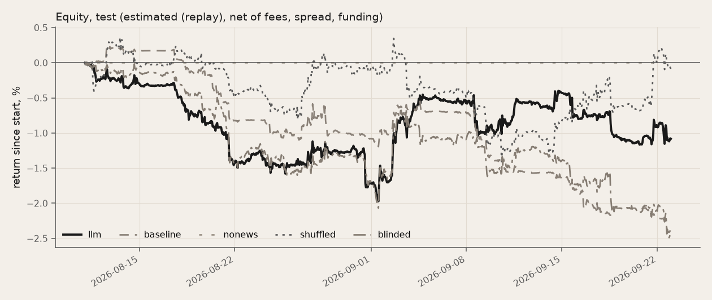
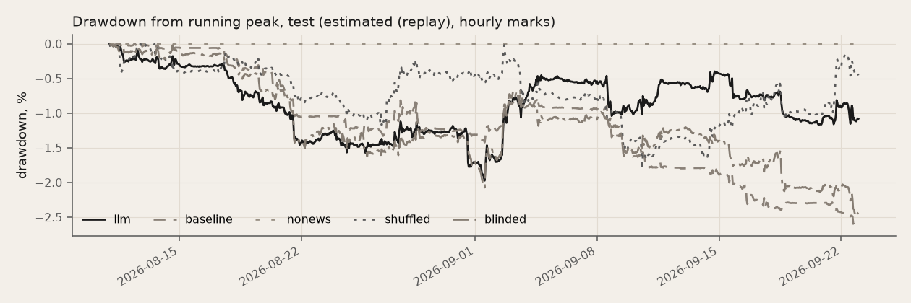
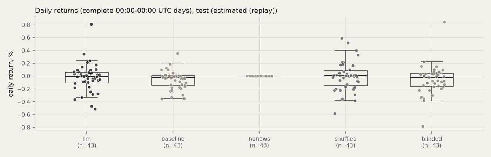

Figures, dev window:

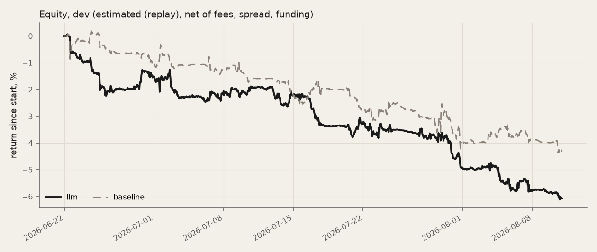
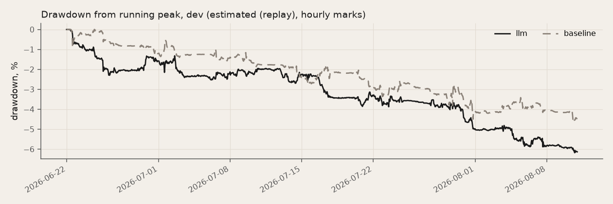
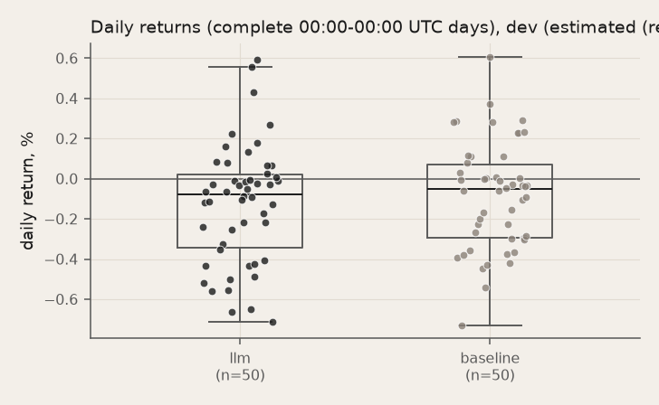

Figures, dev-half window:

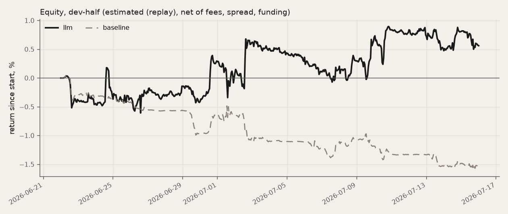
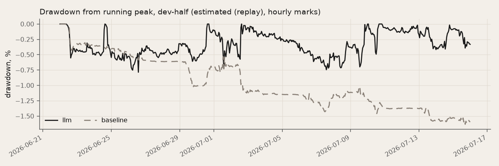
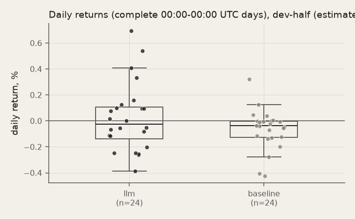

## 6. Is it the news, or something else?

Three placebos run through the same replay, costs and risk layer: **no news** (the agent sees prices, funding and the index only), **shuffled** (every card shown 7–21 days after it appeared, never before) and **blinded** (names and dates masked). **Claim rule**: "news matters" only if the agent beats **both** no news and shuffled with CIs excluding 0; otherwise its P&L cannot be attributed to the news it reads.

| llm vs | Status | Days | Sharpe llm | Sharpe other | Diff | 95% CI | Paths used / drawn | Reading |
|---|---|---:|---:|---:|---:|---|---|---|
| nonews | complete | 43 | −2.18 | n/a | n/a | [n/a, n/a] | 0 / 2000 (2000 dropped) | not readable: no finite bootstrap |
| shuffled | complete | 43 | −2.18 | −0.16 | −2.02 | [−10.49, +5.77] | 2000 / 2000 (0 dropped) | llm not distinguishable from shuffled (95% CI includes 0) |

**Reading**: not claimed (vs nonews: CI n/a; vs shuffled: CI includes 0): the agent's P&L is not attributable to the news it reads.
Blinded control (optional): complete; llm − blinded Sharpe +2.55, 95% CI [−0.37, +5.98] (includes 0, 43 days, 2000 of 2000 bootstrap paths used): blinding names and dates makes no significant difference: no sign of reliance on name priors..

**Market exposure.** The risk layer neutralises beta, so the P&L should not be the market: realised beta (OLS slope of the book's daily gross return on the equal-weight basket of the ten perps) is expected within ±0.03.

| Run | Beta | t | R² | Days | Inside the band |
|---|---:|---:|---:|---:|---|
| llm_v1_2026-08-11_2026-09-22 | +0.008 | +0.50 | 0.01 | 43 | yes |
| baseline_v1_2026-08-11_2026-09-22 | +0.009 | +0.89 | 0.02 | 43 | yes |
| nonews_v1_2026-08-11_2026-09-22 | +0.000 | n/a | n/a | 43 | yes |
| shuffled_v1_2026-08-11_2026-09-22 | −0.002 | −0.11 | 0.00 | 43 | yes |
| blinded_v1_2026-08-11_2026-09-22 | −0.022 | −1.39 | 0.04 | 43 | yes |

## 7. Robustness: what else we tried

Run after the v1 test window, each against criteria written in its trials.log before the run; none changes the v1 submission, which stays as pre-registered. Each module has its own code, trials.log and outputs; the numbers below are read from those outputs.

| Strategy | Window | Evidence | Verdict |
|---|---|---|---|
| Crypto fear & greed as a contrarian signal, BTC and four crypto stocks | 2018-02-01 → 2026-10-01 | estimated (daily closes, simulated) | not claimed: the long-only rule beats buy & hold with a CI excluding 0 in none of the asset-periods and the long/short rule is below buy & hold in nearly all; in 2018-22 most slopes of forward return on F&G are positive (greed was followed by higher returns), the opposite of the contrarian premise |
| Fear & greed on MSTR only, long-only, after its first bitcoin purchase | 2020-08-12 → 2026-10-01 | estimated (daily closes and rToken bars, simulated fills) | not claimed: Sharpe 0.39 vs buy & hold 0.90 and a constant 52% weight 0.90; greed was followed by higher MSTR returns, not lower |
| No news: the ten names long, cut when volatility rises | 2021-01-04 → 2026-10-01 | estimated (replay and daily closes, simulated fills) | not claimed: the rule's Sharpe is above constant exposure with a CI excluding 0 in no window (daily 2021-26 0.82 vs 0.90, same max drawdown -59%); the caps add turnover without lowering drawdown |
| Crisis exit on BTC from free public data | 2019-08-01 → 2026-09-26 | estimated (Bitget BTCUSDT 1h bars, simulated fills) | not claimed: v0 returned +38% against buy & hold +733% with 61% false alarms; no v1 configuration beat the 200-day MA in the design period and the chosen one returned +27% on the holdout against +408% |
| Incident exit: leave a coin on a hack or a delisting | 2021-01-01 → 2026-09-26 | observed (event studies on exchange candles; survivorship understates the falls) | observed, not a strategy: tokens keep falling after both kinds of event, but X trailed the price alert in 9 of 11 hacks (median 72 minutes late), so the edge would be unattended execution, not foresight; not built further |

### 7a. Crypto fear & greed, contrarian

Buy fear and sell greed: does the crypto Fear & Greed index time BTC, MSTR, COIN, MARA and RIOT?

Design: long-only w = clip((75 - F&G)/50, 0, 1) and long/short w = clip((50 - F&G)/50, -1, 1), one day lag, 10 bp per unit turnover; 2018-02..2022-12 and 2023-01..2026-10, each once; pass = beat buy & hold with a block-bootstrap CI excluding 0 in both periods and beat the same rule on BTC 30-day momentum.

| Asset, period | Buy & hold | F&G long-only | F&G long/short | Same rule on BTC momentum | 200-day MA [5] |
|---|---:|---:|---:|---:|---:|
| BTC, P1 | +0.50 | −0.09 | −0.74 | −0.02 | +0.53 |
| BTC, P2 | +1.17 | +0.78 | −0.22 | +0.30 | +1.09 |
| MSTR, P1 | +0.38 | −0.07 | −0.45 | +0.02 | +0.61 |
| MSTR, P2 | +1.17 | +0.88 | −0.19 | +0.20 | +1.11 |
| COIN, P1 | −0.98 | −1.01 | −0.79 | −1.04 | n/a |
| COIN, P2 | +0.95 | +0.62 | −0.28 | −0.01 | +0.34 |
| MARA, P1 | +0.46 | −0.22 | −0.95 | −0.39 | +0.73 |
| MARA, P2 | +0.81 | +1.00 | +0.53 | +0.30 | −0.06 |
| RIOT, P1 | +0.35 | −0.18 | −0.73 | −0.30 | +0.82 |
| RIOT, P2 | +0.96 | +1.10 | +0.54 | +0.31 | +0.03 |

Sharpe ratios, net of 10 bp per unit turnover. The long-only rule beats buy & hold with a CI excluding 0 in 0 of 10 asset-periods; the long/short rule is below buy & hold in 9. In 2018-22, 12 of 15 slopes of the 5/20/60-day forward return on the index are positive: greed was followed by higher returns. Shorting MSTR in greed lost (sum of daily returns) −76% in 2020 and −66% in 2024. Net of 60-day beta × BTC, no stock's return depends on the index (largest |t| +0.95).

### 7b. Fear & greed on MSTR, long-only, with a paper log on the rToken

Restricted to MSTR as a bitcoin holder (from 2020-08-11) and to the long side: hold more in fear, less in greed?

Design: w = clip((75 - F&G)/50, 0, 1): full at F&G <= 25, flat at >= 75; 13 bp per unit turnover; pass = Sharpe above buy & hold and above a constant weight with the same mean exposure, each with a 95% block-bootstrap CI excluding 0. Paper log: the same rule on Bitget's RMSTRUSDT rToken, 1h bars since its listing, hash-chained.

| MSTR daily, 2020-08-12 → 2026-10-01 | Total | CAGR | Sharpe | Max DD | Mean weight |
|---|---:|---:|---:|---:|---:|
| Buy & hold | +1090% | +50% | +0.90 | −89% | 100% |
| F&G rule | +37% | +5% | +0.39 | −75% | 52% |
| Constant, same mean weight | +593% | +37% | +0.90 | −61% | 52% |
| Same rule on BTC momentum | −43% | −9% | +0.15 | −79% | 50% |
| 200-day MA | +2690% | +72% | +1.11 | −68% | 63% |

Sharpe difference, rule − buy & hold: 95% CI [−1.07, +0.05]; rule − constant: [−1.11, +0.06]. MSTR's mean 20-day forward return was +5.4% after F&G ≤ 25 and +18.2% after F&G > 75. In 2022 the rule held 92% on average while MSTR returned −74%.

Paper log on Bitget's RMSTRUSDT rToken, 2026-06-02T07:00 → 2026-10-02T08:00 UTC: 118 hash-chained records (chain verified, last `e959cfa44964a61f…`), 43 trades; rule −19.8% (max DD −43.7%) against the rToken +22.2% and a constant 63% weight +14.0%; with the index used a day later, −15.2%.

### 7c. No news: the ten names long, scaled by volatility

Drop news, ratings and insider filings; hold the ten names long and scale each by its volatility. Better than holding the same average exposure? Volatility-managed portfolios raise Sharpe ratios for factors [10], much less reliably out of sample and for single assets [2].

Design: cap_i = 0.10 x min(1, median vol_7d over the last 60 days / vol_7d); decisions every 4h; v1's simulator and costs; pass = Sharpe above a constant weight with the same mean exposure, CI excluding 0, in the test window AND on 11 months of perp bars AND on 2021-26 daily stock closes.

| Window | Rule | Same mean exposure | Full (10% each) | Rule − same exposure, Sharpe 95% CI | Trades rule / constant |
|---|---|---|---|---|---|
| dev 2026-06-22 → 2026-08-10 | −4.9%, Sharpe −1.00, DD −12.3% | −4.0%, Sharpe −0.85, DD −11.8% | −4.7%, Sharpe −0.83, DD −13.7% | [−0.65, +0.27] | 40 / 11 |
| test 2026-08-11 → 2026-09-22 | +20.1%, Sharpe +4.17, DD −7.2% | +19.2%, Sharpe +3.97, DD −7.5% | +21.1%, Sharpe +3.99, DD −8.1% | [−0.12, +0.43] | 22 / 12 |
| post 2026-09-23 → 2026-10-01 | −4.6%, Sharpe −13.85, DD −6.0% | −4.6%, Sharpe −13.23, DD −6.0% | −5.1%, Sharpe −13.23, DD −6.6% | too short | 12 / 10 |
| long 2025-11-01 → 2026-10-01 | −8.7%, Sharpe −0.14, DD −27.6% | −3.2%, Sharpe +0.06, DD −26.0% | −4.7%, Sharpe +0.05, DD −29.6% | [−0.44, +0.02] | 184 / 42 |
| daily stock closes 2021-01-04 → 2026-09-30 | CAGR +25%, Sharpe +0.82, DD −59% | CAGR +29%, Sharpe +0.90, DD −59% | CAGR +33%, Sharpe +0.90, DD −64% | [−0.21, +0.03] | – |

This book is long about 90% of equity, so its test-window gain is the August-September rally, not the rule: the same exposure without the rule made about as much. It is a different book from v1, not a tuning of it.

### 7d. Crisis exit on BTC

Exit BTC to zero when crash, volatility, stablecoin-depeg or crisis-chatter rules fire; back after a cooldown. Better than a 200-day moving average?

Design: v0: four rules fixed from the literature, 7-day cooldown; v1: 32 configurations chosen on 2019-08..2022-12, the chosen one run once on 2023-01..2026-09; pass = beat buy & hold and the 200-day MA on drawdown and Calmar, with false alarms costing less than the drawdown avoided.

| v0, 2019-08 → 2026-09 | Total | Sharpe | Max DD | Calmar |
|---|---:|---:|---:|---:|
| Buy & hold | +733% | +0.79 | −77% | +0.45 |
| 200-day MA | +620% | +0.82 | −65% | +0.49 |
| 40% vol target | +416% | +0.74 | −65% | +0.40 |
| Crisis module v0 | +38% | +0.30 | −61% | +0.07 |

v0: 90 exits, 55 false alarms (61%); 9 of 9 named crises triggered, most after they began.

| v1 holdout, 2023-01 → 2026-09 | Total | Sharpe | Max DD | Calmar |
|---|---:|---:|---:|---:|
| Chosen configuration | +27% | +0.36 | −59% | +0.11 |
| Buy & hold | +408% | +1.16 | −54% | +1.01 |
| 200-day MA | +257% | +1.09 | −34% | +1.19 |

### 7e. Incident exit: hacks and delistings

After a hack or a Binance delisting notice, does the token keep falling, and does X (Twitter) know before the price does?

Design: event studies on Bitget 1-minute candles: hacks >= $20M from DefiLlama with a >= 5% 60-minute drop as the alert; Binance delisting announcements; then the first post of security and news accounts on X against the price alert.

After 14 hacks with Bitget minute data, the median token return from the price alert was −9.7% over 24 hours and −32.8% over 30 days. After 32 Binance delisting notices it was −4.0% over the first hour and −25.8% to the delisting date. On X, security accounts posted first in 2 of 11 hacks; the median first post came 72 minutes after the price alert.

**Reading**: observed, not a strategy: tokens keep falling after both kinds of event, but X trailed the price alert in 9 of 11 hacks (median 72 minutes late), so the edge would be unattended execution, not foresight; not built further.

## 8. Risk layer and failure modes

### 8a. Test window

Rule effects: count and an estimated first-order P&L effect per binding rule ((after − before) × equity × the name's move to the next decision, frictionless; chained rules add up; later path effects such as cooldowns are ignored).

**llm_v1_2026-08-11_2026-09-22**: beta +0.008 (t +0.50, R² 0.01, 43 days): inside ±0.03.

| Rule | At decision | Hourly | Weight moved | P&L effect (est., USDT) | Meaning |
|---|---:|---:|---:|---:|---|
| name_cap | 1 | 0 | 0.000 | 0.01 | per-name cap (v1: vol-scaled) |
| off_hours | 69 | 0 | 0.019 | 0.04 | outside the US session the cap is scaled for new exposure |
| stop_loss | 1 | 18 | 0.428 | 29.71 | name down its stop from entry -> flat + 24h cooldown (v1: stop = clip(2 x vol_7d, 3%, 10%)) |
| cooldown | 12 | 0 | 0.585 | 21.28 | name in stop-loss cooldown -> 0 |
| beta_neutral | 2437 | 0 | 7.919 | 72.78 | v1: minimal-L2 change to a beta-neutral book |

**baseline_v1_2026-08-11_2026-09-22**: beta +0.009 (t +0.89, R² 0.02, 43 days): inside ±0.03.

| Rule | At decision | Hourly | Weight moved | P&L effect (est., USDT) | Meaning |
|---|---:|---:|---:|---:|---|
| name_cap | 16 | 0 | 0.139 | 5.54 | per-name cap (v1: vol-scaled) |
| off_hours | 92 | 0 | 1.619 | −20.56 | outside the US session the cap is scaled for new exposure |
| stop_loss | 3 | 20 | 0.290 | 5.51 | name down its stop from entry -> flat + 24h cooldown (v1: stop = clip(2 x vol_7d, 3%, 10%)) |
| cooldown | 132 | 0 | 2.083 | −78.27 | name in stop-loss cooldown -> 0 |
| beta_neutral | 2428 | 0 | 18.990 | 302.64 | v1: minimal-L2 change to a beta-neutral book |

**nonews_v1_2026-08-11_2026-09-22**: beta +0.000 (t n/a, R² n/a, 43 days): inside ±0.03.

No rule bound.

**shuffled_v1_2026-08-11_2026-09-22**: beta −0.002 (t −0.11, R² 0.00, 43 days): inside ±0.03.

| Rule | At decision | Hourly | Weight moved | P&L effect (est., USDT) | Meaning |
|---|---:|---:|---:|---:|---|
| off_hours | 60 | 0 | 0.015 | −0.05 | outside the US session the cap is scaled for new exposure |
| stop_loss | 4 | 12 | 0.450 | −2.09 | name down its stop from entry -> flat + 24h cooldown (v1: stop = clip(2 x vol_7d, 3%, 10%)) |
| cooldown | 7 | 0 | 0.505 | 20.30 | name in stop-loss cooldown -> 0 |
| beta_neutral | 2438 | 0 | 6.059 | 54.58 | v1: minimal-L2 change to a beta-neutral book |
| net_cap | 20 | 0 | 0.066 | 1.05 | net exposure cap MAX_NET |

**blinded_v1_2026-08-11_2026-09-22**: beta −0.022 (t −1.39, R² 0.04, 43 days): inside ±0.03.

| Rule | At decision | Hourly | Weight moved | P&L effect (est., USDT) | Meaning |
|---|---:|---:|---:|---:|---|
| name_cap | 1 | 0 | 0.000 | 0.01 | per-name cap (v1: vol-scaled) |
| off_hours | 112 | 0 | 0.033 | −0.08 | outside the US session the cap is scaled for new exposure |
| stop_loss | 4 | 16 | 0.584 | 13.82 | name down its stop from entry -> flat + 24h cooldown (v1: stop = clip(2 x vol_7d, 3%, 10%)) |
| cooldown | 14 | 0 | 0.674 | −19.67 | name in stop-loss cooldown -> 0 |
| beta_neutral | 2399 | 0 | 5.699 | 11.97 | v1: minimal-L2 change to a beta-neutral book |

**Known failure mode.** Beta neutralisation opens hedge positions the model did not ask for; those weights cite no card. A decision chain below shows the requested weight, each rule that changed it and the executed weight.

### 8b. Every run

Binding-rule counts: `at decision` = `risk.apply` at the 4-hourly decision, `hourly` = `risk.check` between decisions. Weight moved = Σ|before − after| in fractions of equity (the daily kill's before/after are equity values and are not summed).

**llm_v1_2026-08-11_2026-09-22** (estimated (replay)): 272 of 272 log records carry a binding rule.

| Rule | At decision | Hourly | Weight moved | P&L effect (est., USDT) | Meaning |
|---|---:|---:|---:|---:|---|
| name_cap | 1 | 0 | 0.000 | 0.01 | per-name cap (v1: vol-scaled) |
| off_hours | 69 | 0 | 0.019 | 0.04 | outside the US session the cap is scaled for new exposure |
| stop_loss | 1 | 18 | 0.428 | 29.71 | name down its stop from entry -> flat + 24h cooldown (v1: stop = clip(2 x vol_7d, 3%, 10%)) |
| cooldown | 12 | 0 | 0.585 | 21.28 | name in stop-loss cooldown -> 0 |
| beta_neutral | 2437 | 0 | 7.919 | 72.78 | v1: minimal-L2 change to a beta-neutral book |

**baseline_v1_2026-08-11_2026-09-22** (estimated (replay)): 276 of 276 log records carry a binding rule.

| Rule | At decision | Hourly | Weight moved | P&L effect (est., USDT) | Meaning |
|---|---:|---:|---:|---:|---|
| name_cap | 16 | 0 | 0.139 | 5.54 | per-name cap (v1: vol-scaled) |
| off_hours | 92 | 0 | 1.619 | −20.56 | outside the US session the cap is scaled for new exposure |
| stop_loss | 3 | 20 | 0.290 | 5.51 | name down its stop from entry -> flat + 24h cooldown (v1: stop = clip(2 x vol_7d, 3%, 10%)) |
| cooldown | 132 | 0 | 2.083 | −78.27 | name in stop-loss cooldown -> 0 |
| beta_neutral | 2428 | 0 | 18.990 | 302.64 | v1: minimal-L2 change to a beta-neutral book |

**nonews_v1_2026-08-11_2026-09-22** (estimated (replay)): 0 of 258 log records carry a binding rule.

No rule bound.

**shuffled_v1_2026-08-11_2026-09-22** (estimated (replay)): 268 of 268 log records carry a binding rule.

| Rule | At decision | Hourly | Weight moved | P&L effect (est., USDT) | Meaning |
|---|---:|---:|---:|---:|---|
| off_hours | 60 | 0 | 0.015 | −0.05 | outside the US session the cap is scaled for new exposure |
| stop_loss | 4 | 12 | 0.450 | −2.09 | name down its stop from entry -> flat + 24h cooldown (v1: stop = clip(2 x vol_7d, 3%, 10%)) |
| cooldown | 7 | 0 | 0.505 | 20.30 | name in stop-loss cooldown -> 0 |
| beta_neutral | 2438 | 0 | 6.059 | 54.58 | v1: minimal-L2 change to a beta-neutral book |
| net_cap | 20 | 0 | 0.066 | 1.05 | net exposure cap MAX_NET |

**blinded_v1_2026-08-11_2026-09-22** (estimated (replay)): 273 of 273 log records carry a binding rule.

| Rule | At decision | Hourly | Weight moved | P&L effect (est., USDT) | Meaning |
|---|---:|---:|---:|---:|---|
| name_cap | 1 | 0 | 0.000 | 0.01 | per-name cap (v1: vol-scaled) |
| off_hours | 112 | 0 | 0.033 | −0.08 | outside the US session the cap is scaled for new exposure |
| stop_loss | 4 | 16 | 0.584 | 13.82 | name down its stop from entry -> flat + 24h cooldown (v1: stop = clip(2 x vol_7d, 3%, 10%)) |
| cooldown | 14 | 0 | 0.674 | −19.67 | name in stop-loss cooldown -> 0 |
| beta_neutral | 2399 | 0 | 5.699 | 11.97 | v1: minimal-L2 change to a beta-neutral book |

**llm_2026-06-22_2026-08-10** (estimated (replay)): 141 of 319 log records carry a binding rule.

| Rule | At decision | Hourly | Weight moved | P&L effect (est., USDT) | Meaning |
|---|---:|---:|---:|---:|---|
| off_hours | 132 | 0 | 0.686 | 0.25 | outside the US session the cap is scaled for new exposure |
| stop_loss | 2 | 19 | 1.234 | 36.06 | name down its stop from entry -> flat + 24h cooldown (v1: stop = clip(2 x vol_7d, 3%, 10%)) |
| cooldown | 41 | 0 | 2.260 | −18.39 | name in stop-loss cooldown -> 0 |
| net_cap | 72 | 0 | 0.399 | −7.71 | net exposure cap MAX_NET |

**baseline_2026-06-22_2026-08-10** (estimated (replay)): 195 of 323 log records carry a binding rule.

| Rule | At decision | Hourly | Weight moved | P&L effect (est., USDT) | Meaning |
|---|---:|---:|---:|---:|---|
| off_hours | 125 | 0 | 5.268 | −4.85 | outside the US session the cap is scaled for new exposure |
| funding_block | 2 | 0 | 0.022 | 1.41 | \|funding\| >= FUNDING_BLOCK blocks new exposure on the paying side |
| stop_loss | 7 | 29 | 0.600 | 11.15 | name down its stop from entry -> flat + 24h cooldown (v1: stop = clip(2 x vol_7d, 3%, 10%)) |
| cooldown | 207 | 0 | 5.052 | −189.42 | name in stop-loss cooldown -> 0 |
| net_cap | 292 | 0 | 6.278 | 77.46 | net exposure cap MAX_NET |

**llm_v1_2026-06-22_2026-07-15** (estimated (replay)): 150 of 151 log records carry a binding rule.

| Rule | At decision | Hourly | Weight moved | P&L effect (est., USDT) | Meaning |
|---|---:|---:|---:|---:|---|
| name_cap | 3 | 0 | 0.003 | 0.04 | per-name cap (v1: vol-scaled) |
| off_hours | 78 | 0 | 0.022 | −0.46 | outside the US session the cap is scaled for new exposure |
| stop_loss | 3 | 7 | 0.468 | 17.68 | name down its stop from entry -> flat + 24h cooldown (v1: stop = clip(2 x vol_7d, 3%, 10%)) |
| cooldown | 10 | 0 | 0.529 | −5.01 | name in stop-loss cooldown -> 0 |
| beta_neutral | 1346 | 0 | 3.529 | 30.77 | v1: minimal-L2 change to a beta-neutral book |

**baseline_v1_2026-06-22_2026-07-15** (estimated (replay)): 152 of 153 log records carry a binding rule.

| Rule | At decision | Hourly | Weight moved | P&L effect (est., USDT) | Meaning |
|---|---:|---:|---:|---:|---|
| name_cap | 14 | 0 | 0.278 | −3.77 | per-name cap (v1: vol-scaled) |
| off_hours | 42 | 0 | 0.667 | 27.81 | outside the US session the cap is scaled for new exposure |
| funding_block | 2 | 0 | 0.022 | 1.42 | \|funding\| >= FUNDING_BLOCK blocks new exposure on the paying side |
| stop_loss | 6 | 10 | 0.239 | −28.09 | name down its stop from entry -> flat + 24h cooldown (v1: stop = clip(2 x vol_7d, 3%, 10%)) |
| cooldown | 90 | 0 | 1.599 | −2.28 | name in stop-loss cooldown -> 0 |
| beta_neutral | 1321 | 0 | 9.323 | 70.56 | v1: minimal-L2 change to a beta-neutral book |

**live** (estimated (shadow ledger: simulated fills at live-venue quotes)): 74 of 75 log records carry a binding rule.

| Rule | At decision | Hourly | Weight moved | P&L effect (est., USDT) | Meaning |
|---|---:|---:|---:|---:|---|
| invalid | 2 | 0 | 0.000 | – | LLM output invalid -> hold the current book |
| off_hours | 8 | 0 | 0.001 | – | outside the US session the cap is scaled for new exposure |
| stop_loss | 0 | 2 | 0.130 | – | name down its stop from entry -> flat + 24h cooldown (v1: stop = clip(2 x vol_7d, 3%, 10%)) |
| cooldown | 3 | 0 | 0.140 | – | name in stop-loss cooldown -> 0 |
| beta_neutral | 694 | 0 | 1.326 | – | v1: minimal-L2 change to a beta-neutral book |

### 8c. Decisions: requested → risk actions → executed → fills

From `llm_v1_2026-08-11_2026-09-22` (complete): the 3 decisions with the largest executed rebalance (Σ |fill notional| / equity). Per name: previous target, the model's requested weight, each risk rule that bound (before → after, in order), the post-risk target, the weight the fills actually moved, and the fills. Names whose weights moved less than 0.0001 and did not trade are left out; a post-risk target that differs from the previous one with no fill is inside the no-churn band. Cited cards are only those in the decision's logged shown set, with the text of the cached prompt the model received.

#### 8c.1. 2026-09-01 04:00:00+00:00 · executed rebalance +34.40% of equity (9,827.75 USDT)

Risk v1, prompt v1, confidence +0.60, 30 cards shown.

| Name | Previous | Requested | Risk actions (in order) | Post-risk target | Executed Δw | Fills |
|---|---:|---:|---|---:|---:|---|
| NVDA | +0.002 | +0.070 | beta_neutral +0.070 → +0.067 | +0.067 | +0.064 | buy 2.8781 @ 220.19 (fee 0.38) |
| AAPL | −0.000 | +0.050 | beta_neutral +0.050 → +0.050 | +0.050 | +0.050 | buy 1.5615 @ 317.22 (fee 0.30) |
| GOOGL | +0.063 | +0.061 | beta_neutral +0.061 → +0.059 | +0.059 | +0.000 | – |
| META | −0.046 | +0.070 | beta_neutral +0.070 → +0.067 | +0.067 | +0.116 | buy 1.9854 @ 572.67 (fee 0.68) |
| AMZN | +0.052 | +0.051 | beta_neutral +0.051 → +0.050 | +0.050 | +0.000 | – |
| TSLA | −0.075 | −0.040 | beta_neutral −0.040 → −0.046 | −0.046 | +0.035 | buy 0.9318 @ 366.69 (fee 0.21) |
| MSTR | +0.008 | +0.000 | beta_neutral +0.000 → −0.009 | −0.009 | −0.017 | sell 1.2833 @ 131.73 (fee 0.10) |
| COIN | +0.007 | +0.000 | beta_neutral +0.000 → −0.008 | −0.008 | −0.017 | sell 0.8837 @ 187.16 (fee 0.10) |
| HOOD | +0.007 | +0.000 | beta_neutral +0.000 → −0.008 | −0.008 | −0.017 | sell 1.5732 @ 105.89 (fee 0.10) |
| CRCL | +0.018 | +0.000 | beta_neutral +0.000 → −0.009 | −0.009 | −0.028 | sell 2.8749 @ 94.71 (fee 0.16) |

**NVDA** (executed +0.064): “Fresh $3.5B MediaTek convertible bond and NVLink Fusion integration is a strong new catalyst with minimal price reaction yet.”
- `b579089dd7-1` [NVDA] 2h old, since NVDA -8 bp, stance +2, strength 0.90, new: Nvidia will buy $3.5B of MediaTek convertible bonds and integrate MediaTek onto NVLink Fusion for rack-scale AI infrastructure.
- `f877d633e9-2` [sector] 1h old, stance +1, strength 0.70, recap: JPMorgan argues AI demand is badly underestimated ahead of Broadcom's Q3 print, with guided AI semiconductor revenue of $16B representing over 200% YoY growth.

**AAPL** (executed +0.050): “New CEO appointment and upcoming Sept 9 event with foldable iPhone and on-device AI provide fresh positive momentum.”
- `b579089dd7-0` [AAPL] 2h old, since AAPL +5 bp, stance +1, strength 0.70, new: John Ternus takes over as Apple CEO; Sept. 9 event expected to showcase foldable iPhone, Gemini-based Siri, and on-device AI hardware.

**META** (executed +0.116): “Flipping short to long on the major new 6.6 GW nuclear power deals for data centers, which have barely moved the stock yet.”
- `b579089dd7-4` [META] 2h old, since META -6 bp, stance +2, strength 0.90, new: Meta signed deals with Oklo, Vistra, and TerraPower for up to 6.6 GW of nuclear power by 2035 for PJM-region data centers.

Log record `6cdc63ff806a36ea0ef3725f374f19a41afd4ae6a5100aa61141d2d4bb750176`, LLM request `bb4e46e68f7e7e3d3f54c993b42176568f07f8c478cfd595b9b72a3abb89ef62`.

#### 8c.2. 2026-09-21 16:00:00+00:00 · executed rebalance +27.87% of equity (9,887.66 USDT)

Risk v1, prompt v1, confidence +0.60, 17 cards shown.

| Name | Previous | Requested | Risk actions (in order) | Post-risk target | Executed Δw | Fills |
|---|---:|---:|---|---:|---:|---|
| NVDA | +0.000 | +0.060 | beta_neutral +0.060 → +0.055 | +0.055 | +0.054 | buy 2.3889 @ 225.32 (fee 0.32) |
| AAPL | +0.000 | +0.000 | beta_neutral +0.000 → −0.000 | −0.000 | −0.000 | sell 0.0069 @ 337.83 (fee 0.00) |
| GOOGL | +0.030 | +0.030 | beta_neutral +0.030 → +0.027 | +0.027 | +0.000 | – |
| META | +0.000 | +0.080 | beta_neutral +0.080 → +0.076 | +0.076 | +0.076 | buy 1.0388 @ 720.95 (fee 0.45) |
| AMZN | +0.059 | +0.000 | beta_neutral +0.000 → −0.003 | −0.003 | −0.062 | sell 2.4110 @ 256.03 (fee 0.37) |
| TSLA | −0.030 | −0.040 | beta_neutral −0.040 → −0.049 | −0.049 | −0.019 | sell 0.5093 @ 375.40 (fee 0.11) |
| COIN | +0.007 | +0.050 | beta_neutral +0.050 → +0.031 | +0.031 | +0.024 | buy 1.1657 @ 203.52 (fee 0.14) |
| HOOD | +0.001 | +0.000 | beta_neutral +0.000 → −0.019 | −0.019 | −0.020 | sell 1.5573 @ 124.57 (fee 0.12) |
| CRCL | +0.002 | +0.000 | beta_neutral +0.000 → −0.021 | −0.021 | −0.023 | sell 2.4066 @ 93.92 (fee 0.14) |

**NVDA** (executed +0.054): “Jensen Huang's guidance that chip shipments could double next year plus the Vera Rubin NVL72 MLPerf debut is strong fresh catalyst.”
- `963b3cd022-0` [NVDA] 15h old, since NVDA +121 bp, stance +1, strength 0.70, new: Jensen Huang said chip unit shipments could double next year; Nvidia co-launched an AI energy alliance with Google and debuted Vera Rubin NVL72 on MLPerf.

**META** (executed +0.076): “Wells Fargo's significant price target increase to $796 is a strong fresh catalyst justifying a new long despite the recent rally.”
- `9fd012ef6c-0` [META] 2h old, since META +575 bp, stance +2, strength 0.62, new: Wells Fargo maintains META Overweight, PT 640 -> 796 (+24%)

**AMZN** (executed −0.062): “Closing position as there is no fresh evidence to support holding against macro headwinds.”
- no shown card cited

Log record `81b2f45f6698f4cd4fb89b427d7e32588b825d82acc59483287e33843a5a2807`, LLM request `725c6c01ce82c980536a6035d2a3ecb6b7163c3dba549aba117c033828f4b0d2`.

#### 8c.3. 2026-09-16 04:00:00+00:00 · executed rebalance +27.78% of equity (9,920.54 USDT)

Risk v1, prompt v1, confidence +0.45, 45 cards shown.

| Name | Previous | Requested | Risk actions (in order) | Post-risk target | Executed Δw | Fills |
|---|---:|---:|---|---:|---:|---|
| NVDA | −0.001 | +0.000 | beta_neutral +0.000 → +0.001 | +0.001 | +0.003 | buy 0.1261 @ 213.44 (fee 0.02) |
| AAPL | −0.000 | +0.000 | beta_neutral +0.000 → +0.000 | +0.000 | +0.000 | buy 0.0053 @ 332.09 (fee 0.00) |
| GOOGL | −0.000 | +0.030 | beta_neutral +0.030 → +0.031 | +0.031 | +0.033 | buy 0.9616 @ 345.29 (fee 0.20) |
| META | −0.001 | +0.000 | beta_neutral +0.000 → +0.001 | +0.001 | +0.003 | buy 0.0418 @ 672.13 (fee 0.02) |
| AMZN | +0.078 | +0.000 | beta_neutral +0.000 → +0.001 | +0.001 | −0.078 | sell 3.1167 @ 249.11 (fee 0.47) |
| TSLA | −0.040 | +0.000 | beta_neutral +0.000 → +0.003 | +0.003 | +0.041 | buy 1.1392 @ 357.56 (fee 0.24) |
| MSTR | +0.038 | +0.000 | beta_neutral +0.000 → +0.005 | +0.005 | −0.038 | sell 2.9555 @ 128.71 (fee 0.23) |
| COIN | +0.034 | +0.000 | beta_neutral +0.000 → +0.005 | +0.005 | −0.032 | sell 1.8344 @ 172.08 (fee 0.19) |
| HOOD | −0.063 | −0.030 | beta_neutral −0.030 → −0.025 | −0.025 | +0.038 | buy 3.4139 @ 109.95 (fee 0.23) |
| CRCL | −0.003 | +0.000 | beta_neutral +0.000 → +0.006 | +0.006 | +0.011 | buy 1.3167 @ 85.13 (fee 0.07) |

**AMZN** (executed −0.078): “The severe AWS Bahrain/UAE outage (strength 0.7) offsets the older Qualcomm deal, and the position is already near its stop at +0.079 so I am closing it.”
- `00ec71dfda-2` [AMZN] 2h old, since AMZN +13 bp, stance -1, strength 0.70, new: AWS could not restore access to damaged infrastructure in Bahrain and one UAE availability zone, though many customers recovered via migration or backups.
- `591b171fa9-1` [AMZN] 50h old, since AMZN -234 bp, stance +1, strength 0.70, new: AWS signed a multi-generation custom inference chip and optical interconnect deal with Qualcomm, backed by a warrant for up to $60B in purchases.

**TSLA** (executed +0.041): “No evidence cards in the last 72 hours; closing the short as there is no informational basis to hold it.”
- no shown card cited

**MSTR** (executed −0.038): “Barclays upgrade is strong but 14h old with MSTR down 269bp since, suggesting the market has digested or rejected the news amid crypto headwinds.”
- `85dfbde86b-0` [MSTR] 14h old, since MSTR -269 bp, stance +2, strength 0.65, new: Barclays maintains MSTR Overweight, PT 125 -> 160 (+28%)

Log record `7f9ec15baac06f5bcdf0fdbbac75bae1f44356f610a5add88237b979b12a6095`, LLM request `1fcf8bb94492d04e609028e4745955976e89b0aa11e252aede5160be6b7bb202`.

## 9. Live log, deviations and limits

### 9a. Live paper log

`out/live`, broker mode shadow: **estimated (shadow ledger: simulated fills at live-venue quotes)**. 75 log records; ledger verified.

Equity: 291 hourly marks, return −0.27%, max DD −0.98%, 11 complete days (partial first day 14h, partial last day 12h), fees 13.92, spread 1.20 USDT. Too short for Sharpe or win rate to mean anything.

| Risk version | Records | Decisions | Risk exits | Fills | Invalid | Errors | Prompt versions | First | Last |
|---|---:|---:|---:|---:|---:|---:|---|---|---|
| v0 | 1 | 1 | 0 | 3 | 0 | 0 | v0 1 | 2026-09-23 12:00:00+00:00 | 2026-09-23 12:00:00+00:00 |
| v1 | 74 | 72 | 2 | 133 | 2 | 2 | v1 72 | 2026-09-23 16:00:00+00:00 | 2026-10-05 12:00:00+00:00 |

**Replay-vs-live reconciliation** (`out/live/reconcile.json`):

75 live records, 73 decisions: identical 15 (21%), unverifiable 2; prompt identity 21%, post-risk targets identical 21%, risk context rebuilt 72 (mismatched 56); hourly checks 218, exit identity 100%; position breaks 0; mismatch inputs {"evidence": 53, "risk_ctx": 56, "state": 26}; store raw. Inputs, not code, explain the rest: the Store now yields cards at t that the live step did not see (items that reached the Store after the step) in 53 of 73 decisions, the live step saw cards the Store no longer yields at t in 45, and 32 of 75 live steps logged a data-source error (HTTP 503) and decided on stale inputs; every decision whose inputs match is reproduced exactly.

| Broker mode | Label | Orders | Matched | Fill gap median (bp, + = live worse) | p90 | Live mid vs bar open (median) | Demo mid vs live mid (median) |
|---|---|---:|---:|---:|---:|---:|---:|
| shadow | estimated (shadow ledger: simulated fills at live-venue quotes) | 119 | 115 | +0.2 bp | +15.5 bp | +0.1 bp | −12.8 bp |

A shadow gap compares two fill models (live quotes vs the replay's next-bar open); only Demo fills are exchange fills. Decision identity: **observed (the replay code recomputes each logged live decision)**; fill gap: **estimated (shadow ledger: live-quote fill model vs the replay's fill model)**.

Figures, live:

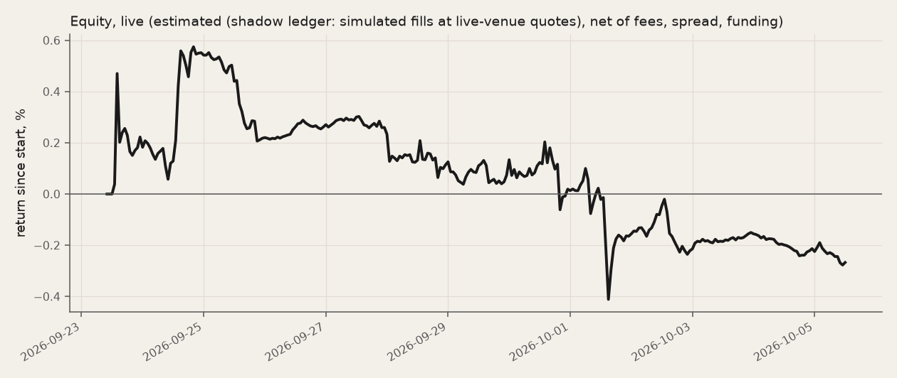
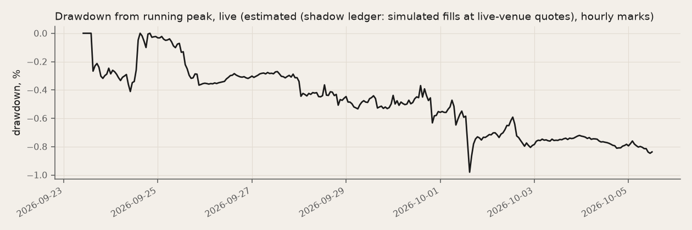
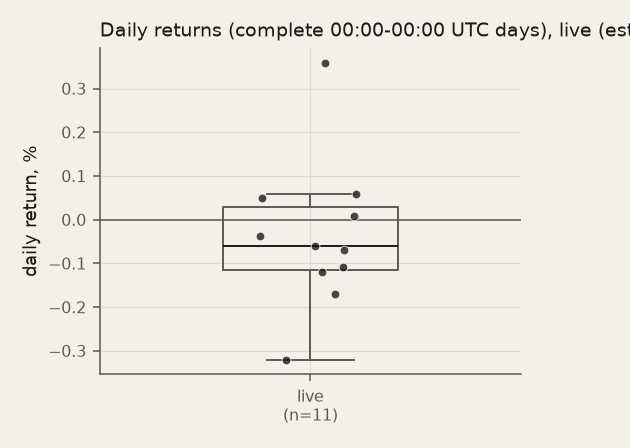

### 9b. Deviations and errata

PREREG.md is frozen, so dated deviations and errata are listed here and appended to trials.log; git commit times are authoritative. PREREG's own Deviations section: "- 2026-09-23 14:20 UTC, **timestamps**: the "FROZEN ~14:45 UTC" in the Status line was written ahead of time and is wrong. The freeze is commit `62286d9` at 13:32:47 UTC, and git is authoritative. The baseline test run started at 13:32:53 UTC, after the freeze. - 2026-09-23 14:20 UTC, **code after freeze**: `sentiment/replay.py` (a `code_stamp` field) and `sentiment/metrics.py` (daily statistics on complete UTC days, counts of bootstrap paths) were edited at about 13:38 UTC, before the llm/nonews/shuffled test runs started on that tree. Neither edit touches decisions, risk actions or fills. Proof: every test run is rerun offline from a clean checkout of `62286d9`, and the log hashes are compared in `sentiment/out/freeze_rerun.json`. - 2026-09-23 14:20 UTC, **signal test (c)**: the event direction now comes only from cards known at the entry bar. The previous version used every card of the ticker-day, which looks ahead. Forward windows must end before the window end. This was fixed before any test-window signal test was run; the dev before/after values are in `trials.log`." (**entries added since the freeze**).

- **2026-09-23, hand-written freeze and trials.log stamps are wrong (git commit times are authoritative).** PREREG.md says "FROZEN 2026-09-23 ~14:45 UTC", and trials.log entries 2-5 are stamped 12:10, 12:10, 13:30 and 14:40 UTC; these stamps were written by hand ahead of time. Per git, entries 2-3 (v0 dev results) were committed in dac95b5 at 12:07:55 UTC, entry 4 (risk v1) in 2ed0093 at 12:59:36 UTC, and entry 5 (prompt-v1 check) with the freeze in 62286d9 at 13:32:47 UTC. The test runs started after 62286d9; the freeze time printed in section 3 is read from git.
- **2026-09-23, replay.py and metrics.py edited after the freeze, before the llm/nonews/shuffled test runs.** sentiment/replay.py (adds the code_stamp field to metrics.json) and sentiment/metrics.py (daily statistics over complete UTC days, bootstrap path counts) were edited after the freeze commit and were uncommitted when the llm, nonews and shuffled test runs started (the baseline test run used the freeze-commit code). By inspection neither edit reaches a decision, risk action or fill (metrics are computed after the replay loop); this counts as verified only when a rerun from a clean checkout of the freeze commit ends on the same log_last_hash (freeze_rerun.json, section 9b).
- **2026-09-23, signal test (c): direction only from cards known at the event's entry.** Test (c) took each ticker-day's direction (and whether it counts) from all cards of that UTC day, including cards available hours after the entry bar its return is measured from: a look-ahead. Fixed before the test-window signal tests were run: the direction now comes only from the cards available at the event's entry bar; the all-day version is kept as a descriptive field (all_day_sign). Test (b) is unaffected (a rating ticker-day has one availability time).
- **2026-09-23, signal tests: a forward window must end strictly before the window end.** The snapshot keeps only bars that close by the window end, so an exit exactly at the test window's end had no price (the dev window had one) and was counted as 'no IC' / 'no price'. Now every forward window must end strictly before the window end in both windows, and a missing price is its own skip reason. Changed before the test-window signal tests were run.
- **2026-09-23, project split (075a0d4): config.py, evidence.py, llm.py and replay.py differ from the freeze in paths only.** The research repo was split into one directory per project (075a0d4 moved sentiment/ to b-sentiment-agent/sentiment/ without edits). After the move, config.py (data, snapshot, cache, out and .env locations relative to the project directory), evidence.py (news_items reads config.RAW), llm.py (reads config.ENV_FILE) and replay.py (git pathspecs of code_stamp; --cards-from written before the split resolved via config.run_dir) were edited for paths only, so the code-provenance list shows them as differing from the freeze commit. No decision, risk action, fill or metric changed: offline replays after the edits end on the same log_last_hash as the shipped runs.

**Test-run code**: all 5 test runs used the freeze-commit 62286d9 replay code (git stamp, or a rerun from the freeze commit ending on the same log_last_hash).

| Test run | Code stamp | Code check | Rerun from the freeze commit |
|---|---|---|---|
| llm_v1_2026-08-11_2026-09-22 | `62286d9-dirty` | replay code identical to the PREREG freeze commit 62286d9; the run also had uncommitted changes (-dirty), not verifiable from git (checked in the research repo at export, PROVENANCE.json) | same log_last_hash |
| baseline_v1_2026-08-11_2026-09-22 | `–` | no code_stamp recorded (run made before replay wrote one) (checked in the research repo at export, PROVENANCE.json) | same log_last_hash |
| nonews_v1_2026-08-11_2026-09-22 | `40e1a8d` | replay code differs from the PREREG freeze commit 62286d9 in sentiment/metrics.py, sentiment/replay.py (checked in the research repo at export, PROVENANCE.json) | same log_last_hash |
| shuffled_v1_2026-08-11_2026-09-22 | `40e1a8d` | replay code differs from the PREREG freeze commit 62286d9 in sentiment/metrics.py, sentiment/replay.py (checked in the research repo at export, PROVENANCE.json) | same log_last_hash |
| blinded_v1_2026-08-11_2026-09-22 | `ba9ba86` | replay code differs from the PREREG freeze commit 62286d9 in b-sentiment-agent/sentiment/config.py, b-sentiment-agent/sentiment/evidence.py, b-sentiment-agent/sentiment/llm.py, b-sentiment-agent/sentiment/metrics.py, b-sentiment-agent/sentiment/replay.py (checked in the research repo at export, PROVENANCE.json) | same log_last_hash |

Freeze rerun file `out/freeze_rerun.json`: present.

**Trials** (`trials.log`, 13 entries):

| When (UTC) | Window | Change | Verdict |
|---|---|---|---|
| 2026-09-23T10:46 | dev smoke 2026-07-01..07-03 | review fixes (all variants): no-churn band max(0.25% equity, 25% of \|target w\|) instead of a flat 0.25%; stop-loss and daily kill checked on every hourly mark (risk.check) with the entry re-averaged … | – |
| 2026-09-23T12:10 | dev 2026-06-22..2026-08-10 | baseline v0 (CONTRACT formula), first full dev run | – |
| 2026-09-23T12:10 | dev 2026-06-22..2026-08-10 | llm v0 (prompts/decide.md at 94cbe51), first full dev run | – |
| 2026-09-23T13:30 | dev 2026-06-22..2026-08-10 | risk v1 (fixed before test, not tuned on dev P&L): trailing-60d beta neutralisation (minimal-L2, within caps), vol-scaled per-name cap MAX_W_NAME*clip(median_vol/vol_i,0.33,1), stop clip(2*vol_7d at … | pass all three (both policies) |
| 2026-09-23T14:40 | dev first half 2026-06-22..2026-07-15 (144 decisions), cards pinned to the v0 dev run | prompt v1 + risk v1 with Qwen (first live exercise of the risk-aware prompt) | FAIL on the explainability criteria: showing the caps/cooldowns did not make the model respect them; net-cap clips vanished only because beta neutralisation replaced them. Not iterated further (no prompt tuning on dev, per DIAGNOSIS-dev.md… |
| 2026-09-23T14:10 | none (erratum) | erratum: hand-written timestamps | – |
| 2026-09-23T14:10 | test 2026-08-11..2026-09-22 | deviation: replay-path code edited after the freeze, before the llm/nonews/shuffled test runs | – |
| 2026-09-23T14:10 | dev 2026-06-22..2026-08-10 (signal tests only; test-window signal tests not yet run) | signal tests: (c) direction only from cards known at the event's entry bar (was: every card of the ticker-day, a look-ahead); every forward window must end strictly before the window end (the test sn… | – |
| 2026-09-23T16:19 | none (deviation, no run) | deviation: project split (075a0d4) path-only edits to replay-path files | – |
| 2026-09-23T17:31 | TEST 2026-08-11..2026-09-22 (pre-registered, run once, v1) | none — pre-registered test runs per docs/PREREG.md (frozen 62286d9) | – |
| 2026-09-28T15:59 | LIVE shadow 2026-09-23 12:00 -> 2026-09-28 12:00 UTC (sealed) | none - live shadow loop stopped by hand after the 2026-09-28 15:00 UTC hourly step, log sealed (out/live/SEAL.json: file sha256 + last record hash 0ef7d7a1...); reconcile rerun over the sealed log; r… | – |
| 2026-09-28T16:52 | LIVE shadow segment 2 from 2026-09-28T16:52:29Z | none - live shadow loop restarted (same code, risk v1, prompt v1, shadow ledger) after the submission deadline was extended to 2026-10-08; records append to the same hash chain after the segment-1 se… | – |
| 2026-10-05T12:03 | LIVE shadow 2026-09-23 12:00 -> 2026-10-05 12:00 UTC (sealed, final) | none - live shadow loop stopped by hand after the 2026-10-05 12:00 UTC decision step (user decision); log sealed by scripts/seal_live.py (out/live/SEAL.json: file hashes, last record hash; segment 1 … | – |

**Prompt v1 explainability: FAIL** (2026-09-23T14:40). Criteria declared before the run: cooldown re-requests near 0; off-hours and net-cap clips fall sharply (P&L not a criterion). Before → after: cooldown rerequests 14 → 10; off hours clips 60 → 78; net cap clips 72 → 0; beta neutral actions 0 → 1346. The prompt was frozen anyway; explainability is shown per decision in section 8c.

### 9c. What this does not prove

- **Short sample.** 43 days: the headline Sharpe −2.18 has a standard error of about 2.92 [8] (95% interval −7.91 to +3.55).
- **Estimated fills.** Every replay number and the whole live log are simulated fills; no Bitget Demo key was set, so nothing here is an exchange fill.
- **Many trials.** Besides the pre-registered runs, the dev variants in trials.log and the 5 strategies of section 7 were tried. The more one tries, the higher the bar a single good result must clear [7]; none of them cleared even its own.
- **One model, one universe.** One LLM (`qwen3.8-max`) at temperature 0, ten names chosen in 2026-09; a different model, prompt or universe is a different experiment.
- **Cards describe more than they predict.** A large share of news cards explain a move that already happened (section 2).

## 10. References

Each entry was checked against Crossref (DataCite for the arXiv paper).

1. Baker, M., Wurgler, J. (2006). Investor sentiment and the cross-section of stock returns. *Journal of Finance*, 61(4), 1645–1680. https://doi.org/10.1111/j.1540-6261.2006.00885.x
2. Cederburg, S., O'Doherty, M. S., Wang, F., Yan, X. S. (2020). On the performance of volatility-managed portfolios. *Journal of Financial Economics*, 138(1), 95–117. https://doi.org/10.1016/j.jfineco.2020.04.015
3. Chan, W. S. (2003). Stock price reaction to news and no-news: Drift and reversal after headlines. *Journal of Financial Economics*, 70(2), 223–260. https://doi.org/10.1016/S0304-405X(03)00146-6
4. Da, Z., Engelberg, J., Gao, P. (2015). The sum of all FEARS: Investor sentiment and asset prices. *Review of Financial Studies*, 28(1), 1–32. https://doi.org/10.1093/rfs/hhu072
5. Faber, M. T. (2007). A quantitative approach to tactical asset allocation. *Journal of Wealth Management*, 9(4), 69–79. https://doi.org/10.3905/jwm.2007.674809
6. Glasserman, P., Lin, C. (2023). Assessing look-ahead bias in stock return predictions generated by GPT sentiment analysis. *arXiv:2309.17322*. https://doi.org/10.48550/arXiv.2309.17322
7. Harvey, C. R., Liu, Y., Zhu, H. (2016). … and the cross-section of expected returns. *Review of Financial Studies*, 29(1), 5–68. https://doi.org/10.1093/rfs/hhv059
8. Lo, A. W. (2002). The statistics of Sharpe ratios. *Financial Analysts Journal*, 58(4), 36–52. https://doi.org/10.2469/faj.v58.n4.2453
9. Lopez-Lira, A., Tang, Y. (2023). Can ChatGPT forecast stock price movements? Return predictability and large language models. *SSRN working paper 4412788*. https://doi.org/10.2139/ssrn.4412788
10. Moreira, A., Muir, T. (2017). Volatility-managed portfolios. *Journal of Finance*, 72(4), 1611–1644. https://doi.org/10.1111/jofi.12513
11. Newey, W. K., West, K. D. (1987). A simple, positive semi-definite, heteroskedasticity and autocorrelation consistent covariance matrix. *Econometrica*, 55(3), 703–708. https://doi.org/10.2307/1913610
12. Politis, D. N., Romano, J. P. (1994). The stationary bootstrap. *Journal of the American Statistical Association*, 89(428), 1303–1313. https://doi.org/10.1080/01621459.1994.10476870
13. Sarkar, S. K., Vafa, K. (2024). Lookahead bias in pretrained language models. *SSRN working paper 4754678*. https://doi.org/10.2139/ssrn.4754678
14. Tetlock, P. C. (2007). Giving content to investor sentiment: The role of media in the stock market. *Journal of Finance*, 62(3), 1139–1168. https://doi.org/10.1111/j.1540-6261.2007.01232.x
15. Tetlock, P. C., Saar-Tsechansky, M., Macskassy, S. (2008). More than words: Quantifying language to measure firms' fundamentals. *Journal of Finance*, 63(3), 1437–1467. https://doi.org/10.1111/j.1540-6261.2008.01362.x

## 11. Reproduce

The replay is a function of the snapshot, the code and the LLM cache (run_id is the run name, no wall-clock values), so an offline rerun (`SENTIMENT_OFFLINE=1`, no `.env` needed) reproduces its log hashes on the platform that wrote them, macOS on Apple silicon (CI checks it there); a cache miss stops the run instead of calling the model. On Linux x86_64 the risk v1 runs differ from their first record: the 60-day beta (pandas mean, variance and covariance) rounds differently in its last bits, and the weights and fills follow it; the v0 runs, which have no beta, match on both. Runs are checked against the current data rules by their cited evidence items. Git HEAD `6f56ce3`; PREREG frozen at `62286d9`.

LLM cache `cache/llm`: 2638 responses (decide:b5 6, decide:blinded 258, decide:llm 806, decide:nonews 258, decide:shuffled 258, evidence 1052), 8,901,638 prompt + 929,515 completion tokens.

**Snapshot**: `snapshot/MANIFEST.sha256` sha256 `bda08aeca8e32c3f939e914058c9b165c5591e479a2d836585e1675afa6b68ae`; every file matches: yes.

| File | sha256 | Matches |
|---|---|---|
| crypto_fng.parquet | `e1ed38179d5dd746d71e84b05eb013f3899d1da8f6413eda6e49320c3ad8fce1` | yes |
| funding.parquet | `df98359ccde4ba626bb573060a2e034c1c14b6ea75dd97f402f49d4db0f98190` | yes |
| insider.parquet | `c68c1645c5ac4fe97ba807b7c242b9d79d3e45d3f5f53ec320c1361e04c566d1` | yes |
| news.parquet | `e50ffde3b029417881c633ea1837a053f9eeaa59dd5257d9a54c659cc875b65e` | yes |
| perp.parquet | `af69b31d5948649ab7e976795649ed4f105ba2f13a6e94f4215dc2680557bd3d` | yes |
| ratings.parquet | `147e2396dc786058134e602a2f1af8f7cee7d0d35a4c6c61e97be771064dc432` | yes |
| spot.parquet | `d80f4a0689032ebb9eeb3cb66c185d8fe013159122a80a886f811fdfd2fd41da` | yes |

| Run | Ledger verify | Records | Last hash | Matches the run's metrics.json | Current rules | Code vs PREREG freeze |
|---|---|---:|---|---|---|---|
| llm_v1_2026-08-11_2026-09-22 | ok | 272 | `c407f891c01b240d7571e154bb503564bbdf527c86a83055867939325cd0f379` | yes | yes (287 cited items found) | replay code identical to the PREREG freeze commit 62286d9; the run also had uncommitted changes (-dirty), not verifiable from git (checked in the research repo at export, PROVENANCE.json) |
| baseline_v1_2026-08-11_2026-09-22 | ok | 276 | `368bf8998bcec1301faae3cdaeef855f67f842fbf1f3182b7ae8d513469cf666` | yes | yes (349 cited items found) | no code_stamp recorded (run made before replay wrote one) (checked in the research repo at export, PROVENANCE.json) |
| nonews_v1_2026-08-11_2026-09-22 | ok | 258 | `a930af0603f708471b1db90fe198bcf80f933e640495efd732d753a7f7217759` | yes | yes (0 cited items found) | replay code differs from the PREREG freeze commit 62286d9 in sentiment/metrics.py, sentiment/replay.py (checked in the research repo at export, PROVENANCE.json) |
| shuffled_v1_2026-08-11_2026-09-22 | ok | 268 | `9a10baf756bdcf0e53e4d84d8fbbcfea1f69e091df6e11d0b41ff6c265077155` | yes | yes (352 cited items found) | replay code differs from the PREREG freeze commit 62286d9 in sentiment/metrics.py, sentiment/replay.py (checked in the research repo at export, PROVENANCE.json) |
| blinded_v1_2026-08-11_2026-09-22 | ok | 273 | `7044c58a39d55c25a970fe0fea98df01588d54e4edf85713c8a18802e54aeedf` | yes | yes (287 cited items found) | replay code differs from the PREREG freeze commit 62286d9 in b-sentiment-agent/sentiment/config.py, b-sentiment-agent/sentiment/evidence.py, b-sentiment-agent/sentiment/llm.py, b-sentiment-agent/sentiment/metrics.py, b-sentiment-agent/sentiment/replay.py (checked in the research repo at export, PROVENANCE.json) |
| llm_2026-06-22_2026-08-10 | ok | 319 | `2d1e55ed3ba5f31632e60dac303e856c0392e0bdba20c7b4498bf22b5c9a1f8f` | yes | yes (414 cited items found) | no code_stamp recorded (run made before replay wrote one) (checked in the research repo at export, PROVENANCE.json) |
| baseline_2026-06-22_2026-08-10 | ok | 323 | `5415d818fd6b90c3eb374b21ea122659e5d8a3e2be7d53e0670ce978a45a2a3e` | yes | yes (414 cited items found) | no code_stamp recorded (run made before replay wrote one) (checked in the research repo at export, PROVENANCE.json) |
| llm_v1_2026-06-22_2026-07-15 | ok | 151 | `d830d8e5915bd08141b8347e72cea35f7b4cbbf425f2bf6929cbd6dff3c3dce9` | yes | yes (139 cited items found) | no code_stamp recorded (run made before replay wrote one) (checked in the research repo at export, PROVENANCE.json) |
| baseline_v1_2026-06-22_2026-07-15 | ok | 153 | `78b4042597d2438df7f9c3f155dbc1118ea7baf4eed8217351a0dbda84d2ba62` | yes | yes (139 cited items found) | no code_stamp recorded (run made before replay wrote one) (checked in the research repo at export, PROVENANCE.json) |
| live | ok | 75 | `e22a2e45ceaa506824c8a1faf60903affd5462bee1367b5bbdc9d4084a80a5d5` | n/a | n/a (live) | n/a |

```bash
# tests
uv run pytest -q tests
# snapshot integrity
uv run python -m sentiment.snapshot --check
# every shipped replay, offline, into judge-out/, checked against its logged last hash (public repo)
uv run python scripts/judge_replay.py
# llm v1, test window (offline, cached LLM replies; compare judge-out/llm_v1_2026-08-11_2026-09-22/metrics.json log_last_hash with out/llm_v1_2026-08-11_2026-09-22/)
SENTIMENT_OFFLINE=1 uv run python -m sentiment.replay --variant llm --start 2026-08-11 --end 2026-09-22 --offline --risk-version v1 --out judge-out/llm_v1_2026-08-11_2026-09-22
# baseline v1, test window (offline, cached LLM replies; compare judge-out/baseline_v1_2026-08-11_2026-09-22/metrics.json log_last_hash with out/baseline_v1_2026-08-11_2026-09-22/)
SENTIMENT_OFFLINE=1 uv run python -m sentiment.replay --variant baseline --start 2026-08-11 --end 2026-09-22 --offline --risk-version v1 --out judge-out/baseline_v1_2026-08-11_2026-09-22
# nonews v1, test window (offline, cached LLM replies; compare judge-out/nonews_v1_2026-08-11_2026-09-22/metrics.json log_last_hash with out/nonews_v1_2026-08-11_2026-09-22/)
SENTIMENT_OFFLINE=1 uv run python -m sentiment.replay --variant nonews --start 2026-08-11 --end 2026-09-22 --offline --risk-version v1 --out judge-out/nonews_v1_2026-08-11_2026-09-22
# shuffled v1, test window (offline, cached LLM replies; compare judge-out/shuffled_v1_2026-08-11_2026-09-22/metrics.json log_last_hash with out/shuffled_v1_2026-08-11_2026-09-22/)
SENTIMENT_OFFLINE=1 uv run python -m sentiment.replay --variant shuffled --start 2026-08-11 --end 2026-09-22 --offline --risk-version v1 --out judge-out/shuffled_v1_2026-08-11_2026-09-22
# blinded v1, test window (offline, cached LLM replies; compare judge-out/blinded_v1_2026-08-11_2026-09-22/metrics.json log_last_hash with out/blinded_v1_2026-08-11_2026-09-22/)
SENTIMENT_OFFLINE=1 uv run python -m sentiment.replay --variant blinded --start 2026-08-11 --end 2026-09-22 --offline --risk-version v1 --out judge-out/blinded_v1_2026-08-11_2026-09-22
# llm v0, dev window (offline, cached LLM replies; compare judge-out/llm_2026-06-22_2026-08-10/metrics.json log_last_hash with out/llm_2026-06-22_2026-08-10/)
SENTIMENT_OFFLINE=1 uv run python -m sentiment.replay --variant llm --start 2026-06-22 --end 2026-08-10 --offline --risk-version v0 --out judge-out/llm_2026-06-22_2026-08-10
# baseline v0, dev window (offline, cached LLM replies; compare judge-out/baseline_2026-06-22_2026-08-10/metrics.json log_last_hash with out/baseline_2026-06-22_2026-08-10/)
SENTIMENT_OFFLINE=1 uv run python -m sentiment.replay --variant baseline --start 2026-06-22 --end 2026-08-10 --offline --risk-version v0 --out judge-out/baseline_2026-06-22_2026-08-10
# llm v1, dev-half window (offline, cached LLM replies; compare judge-out/llm_v1_2026-06-22_2026-07-15/metrics.json log_last_hash with out/llm_v1_2026-06-22_2026-07-15/)
SENTIMENT_OFFLINE=1 uv run python -m sentiment.replay --variant llm --start 2026-06-22 --end 2026-07-15 --offline --risk-version v1 --out judge-out/llm_v1_2026-06-22_2026-07-15 --cards-from out/llm_2026-06-22_2026-08-10
# baseline v1, dev-half window (offline, cached LLM replies; compare judge-out/baseline_v1_2026-06-22_2026-07-15/metrics.json log_last_hash with out/baseline_v1_2026-06-22_2026-07-15/)
SENTIMENT_OFFLINE=1 uv run python -m sentiment.replay --variant baseline --start 2026-06-22 --end 2026-07-15 --offline --risk-version v1 --out judge-out/baseline_v1_2026-06-22_2026-07-15 --cards-from out/llm_2026-06-22_2026-08-10
# ledger hash chains
uv run python -m sentiment.ledger out/*/log.jsonl
# live shadow loop (Bitget live quotes, no key needed)
uv run python -m sentiment.live --run --shadow
# replay-vs-live reconciliation
uv run python -m sentiment.reconcile
# this report
uv run python -m sentiment.report
```
